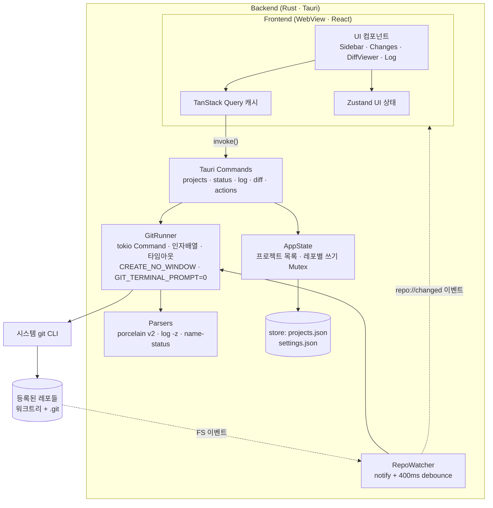
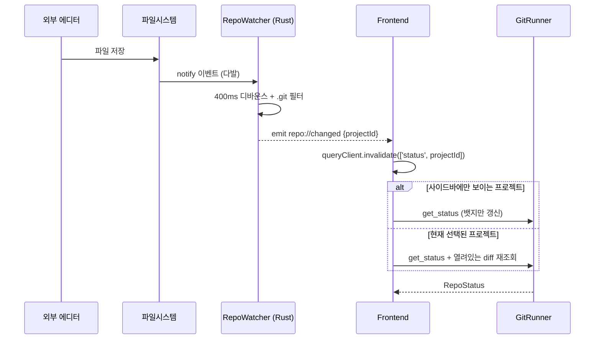

# Gitpervisor — 설계 문서

> 여러 로컬 프로젝트의 git 상태를 한 화면에서 감시하고, 클릭 한 번으로 diff 확인 → 커밋 → 푸시까지 끝내는 멀티 레포 Git 대시보드 데스크톱 앱.

- 작성일: 2026-06-11
- 상태: 설계 (v1)
- 대상 플랫폼: Windows 우선 (Tauri 특성상 macOS/Linux 빌드 가능)

---

## 1. 문제 정의 & 목표

**문제**: 진행 중인 프로젝트가 여러 개라서, 매일 "각 프로젝트 열기 → `git status`/diff 확인 → 커밋 → 푸시"를 반복한다. IDE를 프로젝트마다 띄우는 건 무겁고 느리다.

**목표**: 하나의 가벼운 앱에서

1. 경로로 등록한 모든 프로젝트의 git 상태를 사이드바에서 한눈에 확인
2. 프로젝트 클릭 → 변경 파일 목록 + side-by-side diff 즉시 확인
3. 그 자리에서 stage → commit → push 수행
4. 커밋 히스토리(로그/브랜치/커밋별 변경 파일) 탐색

**비전 한 줄**: "JetBrains 커밋 툴윈도우의 멀티-레포 버전, IDE 없이."

---

## 2. 요구사항

### 기능 요구사항

| ID | 요구사항 | 우선순위 |
|----|---------|---------|
| F1 | 폴더 선택으로 프로젝트 추가/제거/순서변경, 목록 영구 저장 | P0 |
| F2 | 사이드바 프로젝트 항목에 상태 뱃지: 현재 브랜치, 변경 파일 수, ahead/behind(↑↓), 충돌 여부 | P0 |
| F3 | 프로젝트 선택 시 변경 파일 목록 (staged/unstaged/untracked 구분, 체크박스 staging) | P0 |
| F4 | 파일 선택 시 side-by-side diff 뷰어 (구문 하이라이트, 단어 단위 하이라이트, 변경 없는 영역 접기) | P0 |
| F5 | 커밋 메시지 입력 → Commit / Commit & Push (Amend 옵션) | P0 |
| F6 | Push / Pull / Fetch 버튼 + 진행 상황 표시 | P0 |
| F7 | 파일시스템 감시로 상태 자동 갱신 (외부에서 코드 수정 시 사이드바 뱃지 실시간 반영) | P1 |
| F8 | Git 로그 패널: 커밋 리스트(메시지/작성자/날짜), 브랜치 트리(local/remote), 커밋 상세(파일 트리 + 전체 메시지) | P1 |
| F9 | 커밋의 파일 클릭 → 해당 커밋 기준 diff 표시 | P1 |
| F10 | 파일 discard(변경 되돌리기), untracked 삭제 — 확인 다이얼로그 필수 | P1 |
| F11 | 탐색기/터미널/에디터로 열기 바로가기 | P2 |
| F12 | 설정: 자동 fetch 주기, git 실행파일 경로, 테마, diff 폰트 | P2 |

### 비기능 요구사항

| ID | 요구사항 |
|----|---------|
| NF1 | 프로젝트 20개 등록 기준 전체 상태 갱신 < 1초 (병렬 실행) |
| NF2 | 사용자의 기존 git 설정 그대로 사용 — credential helper, SSH agent, hooks, commit signing, .gitconfig |
| NF3 | 셸 인젝션 불가 구조 (인자 배열 실행, 셸 문자열 조합 금지) |
| NF4 | git 명령 실행 시 콘솔 창 깜빡임 없음 (Windows `CREATE_NO_WINDOW`) |
| NF5 | 대용량 파일/바이너리에서 diff 뷰어가 멈추지 않음 (크기 가드) |
| NF6 | 앱이 사용자 동의 없이 레포를 변경하지 않음 (자동 fetch는 기본 OFF, 쓰기 작업은 모두 명시적 버튼) |

---

## 3. 기술 스택 & 선정 근거

| 레이어 | 선택 | 근거 |
|--------|------|------|
| 셸 | **Tauri 2.x** (Rust) | 사용자 지정. 경량 바이너리, Rust 백엔드에서 git 프로세스/파일 감시 처리에 적합 |
| Git 연동 | **시스템 git CLI 호출** (`--porcelain` 포맷 파싱) | 아래 비교 참조 |
| 프론트엔드 | **React 19 + TypeScript + Vite** | Monaco/가상화 등 생태계 최광범위. (Svelte 선호 시 교체 가능 — IPC 계약은 동일) |
| Diff 뷰어 | **Monaco Editor `DiffEditor`** | side-by-side, 단어 단위 인트라라인 하이라이트, `hideUnchangedRegions`(변경 없는 영역 접기), 구문 하이라이트를 전부 내장 — 스크린샷의 JetBrains diff와 가장 근접한 기성품 |
| 상태 관리 | **Zustand**(UI 상태) + **TanStack Query**(git 데이터 캐시/무효화) | 이벤트 기반 invalidate 패턴과 궁합이 좋음 |
| 스타일 | **Tailwind CSS 4** + 다크 토큰 (Monokai 계열) | 스크린샷 테마 재현 용이 |
| 리스트 가상화 | **@tanstack/react-virtual** | 변경 파일 수백 개 / 커밋 로그 수천 개 대응 |
| 파일 감시 | **notify + notify-debouncer-full** (Rust) | 크로스플랫폼 FS 이벤트 + 디바운스 |
| 영속화 | **tauri-plugin-store** | projects.json / settings.json |
| 타입 동기화 | **tauri-specta** (권장) | Rust 커맨드 → TS 바인딩 자동 생성. 부담되면 수동 타입 정의로 시작 |
| 기타 플러그인 | dialog(폴더 선택), opener(탐색기 열기), window-state, single-instance | 표준 구성 |

### 핵심 결정: git CLI vs libgit2(git2 crate)

| 관점 | git CLI 호출 ✅ | libgit2 (git2) |
|------|---------------|----------------|
| 인증 (push/pull) | credential manager·SSH agent **자동 동작** | 콜백 직접 구현 필요 — Windows에서 가장 큰 고통 지점 |
| hooks / signing / .gitconfig | 전부 그대로 동작 | 부분 지원 또는 미지원 |
| Windows 빌드 | 추가 의존성 없음 | openssl/vcpkg 빌드 이슈 빈번 |
| 성능 | 프로세스 spawn 오버헤드(~수십 ms) 있으나 이 규모에선 무의미 | 더 빠름 |
| 파싱 | `--porcelain=v2 -z` 등 **기계 파싱용 안정 포맷 공식 제공** | 구조체 직접 반환 |
| 신기능 추적 | git 업데이트 즉시 반영 | libgit2 구현 대기 |

→ **결정: 전 작업을 git CLI로.** GitHub Desktop(dugite)과 동일한 접근. 단점인 파싱은 porcelain 포맷이 해결하고, 인증·훅·서명이 공짜로 따라오는 가치가 압도적. 전제 조건으로 **git ≥ 2.35가 PATH에 필요** → 앱 시작 시 감지, 없으면 안내 화면.

---

## 4. 시스템 아키텍처



**원칙**

- **Rust = 데이터 소스의 단일 진실.** git 출력 파싱은 전부 Rust에서 끝내고, 프론트엔드는 구조화된 JSON만 받는다.
- **읽기는 병렬, 쓰기는 레포당 직렬.** status/log/diff는 동시 실행, commit/push/stage 등 변경 작업은 레포별 `Mutex`로 큐잉 (서로 다른 레포끼리는 병렬).
- **이벤트 → 무효화 → 재조회.** 백엔드는 "이 레포 바뀜"만 알리고, 프론트는 해당 Query 캐시를 invalidate. 페이로드에 상태를 싣지 않아 레이스가 없다.

---

## 5. UI 설계

### 5.1 전체 레이아웃 (스크린샷 매핑)

JetBrains 커밋 툴윈도우 구조를 그대로 차용하되, 좌측 레일을 "파일"이 아닌 **"프로젝트"** 목록으로 치환한다.

```
┌──────────────┬────────────────────────────────────────────────────────────┐
│  PROJECTS    │  nqvm-ais   main ↑4        [⟳ Fetch] [⤓ Pull] [⤒ Push] [⚙] │
│  ──────────  ├──────────────────┬─────────────────────────────────────────┤
│ ▎● nqvm-ais  │ Changes  34 files│   focus_session_registry.py   15 diffs  │
│ │  main ↑4   │ ──────────────── │ ┌───────────────┬───────────────┐       │
│ │  ●31 ✚2 ?1 │ ▾ ☑ Unstaged 31  │ │ HEAD (old)    │ Worktree (new)│       │
│ ├──────────  │   ☑ M focus_se...│ │ import thre.. │ import thre.. │       │
│ │○ cnvr-vwr  │   ☑ M gallery.cpp│ │               │ +from apiFo.. │       │
│ │  feature ✚2│   ☐ M main_win...│ │ ⌃ make_session_key() 접힘 ⌄   │       │
│ ├──────────  │ ▸ ☑ Staged 2     │ │ -def unregi.. │ +def insta..  │       │
│ │● blog      │ ▸ ☐ Untracked 1  │ └───────────────┴───────────────┘       │
│ │  main ↑1   │ ──────────────── │                                         │
│ │  clean     │ ☐ Amend          │                                         │
│ │            │ ┌──────────────┐ │                                         │
│ │            │ │ 커밋 메시지   │ │                                         │
│ │            │ └──────────────┘ │                                         │
│ │            │ [COMMIT][COMMIT AND PUSH…]                                 │
│  ──────────  ├──────────────────┴─────────────────────────────────────────┤
│  [+ 추가]    │ Log ▾                                                      │
│              │ ┌──────────┬──────────────────────────┬──────────────────┐ │
│              │ │ HEAD     │ ● cnvr-viewer UI 전면 이식│ ▾ 📁 facade 1    │ │
│              │ │ ▾ Local  │   imtelooper · 오후 1:28 │    nvr_manager.. │ │
│              │ │   main ↑4│ ● FRONTEND 패키지 포인터  │ ▾ 📁 focus 1     │ │
│              │ │   feature│   imtelooper · 오전 11:24│ ──────────────── │ │
│              │ │ ▾ Remote │ ● Focus 백엔드 대개편    │ cnvr-viewer 신규 │ │
│              │ │   origin │   imtelooper · 오전 11:24│ 위젯 조립(VodWo..│ │
│              │ └──────────┴──────────────────────────┴──────────────────┘ │
├──────────────┴────────────────────────────────────────────────────────────┤
│ C:\...\nqvm-ais  ·  main  ·  마지막 갱신 방금 전                  UTF-8 LF │
└────────────────────────────────────────────────────────────────────────────┘
```

- **상단 툴바**: 선택 프로젝트명 + 브랜치 위젯(↑↓) + Fetch/Pull/Push + 설정
- **좌중앙 Changes 패널**: staged/unstaged/untracked 그룹 트리, 체크박스 = staging 토글, 우클릭 메뉴(discard, 탐색기에서 열기). 하단에 Amend 체크 + 커밋 메시지 + 버튼 2개
- **우중앙 Diff 패널**: Monaco DiffEditor. 헤더에 파일명, diff 개수, 공백 무시 토글
- **하단 Log 패널**(접이식): 3분할 — 브랜치 트리 / 커밋 리스트 / 커밋 상세(파일 트리 + 전체 메시지)
- **하단 상태바**: 레포 경로, 브랜치, 마지막 갱신 시각

### 5.2 사이드바 프로젝트 항목

```
▎● nqvm-ais          ← 상태 점 + 프로젝트명 (▎= 선택 표시)
   main ↑4 ↓1        ← 브랜치 + ahead/behind
   ●31 ✚2 ?1         ← 수정 31 · staged 2 · untracked 1
```

| 상태 점 | 의미 |
|--------|------|
| 🟢 초록 | clean (변경 없음, push할 것 없음) |
| 🟡 노랑 | 변경 있음 또는 ahead/behind 존재 |
| 🔴 빨강 | 충돌 / merge·rebase 진행 중 |
| ⚫ 회색 | 경로 소실 · git 오류 |

추가 인터랙션: 드래그로 순서 변경, 우클릭(제거 / 탐색기 / 터미널), 항목 더블클릭 = 외부 에디터로 열기(P2).

### 5.3 핵심 인터랙션 흐름

```
프로젝트 추가:  [+ 추가] → OS 폴더 선택 → rev-parse 검증
               → 실패 시 "git 레포가 아님" 토스트 / 성공 시 목록 추가 + 즉시 상태 조회

일상 루프:     외부 에디터에서 코드 수정 → watcher가 감지 → 사이드바 뱃지 자동 갱신(노랑)
               → 클릭 → 변경 파일 확인 → 파일 클릭 → diff 검토
               → 체크박스로 stage → 메시지 입력 → Commit & Push
               → 진행 로그 스트리밍 → 완료 → 뱃지 초록 복귀

히스토리 확인:  하단 Log 펼침 → 커밋 클릭 → 우측에 파일 트리 + 메시지
               → 파일 클릭 → 그 커밋 기준 diff가 중앙 뷰어에 표시
```

키보드 단축키(P2): `Ctrl+K` 커밋, `Ctrl+Shift+K` 푸시, `Ctrl+T` pull, `F5` 새로고침 — JetBrains 동일 배치.

---

## 6. 데이터 모델

프론트엔드 기준 타입 (Rust 측은 동형 serde 구조체, tauri-specta로 동기화):

```typescript
interface Project {
  id: string;            // UUID
  name: string;          // 기본값: 폴더명, 변경 가능
  path: string;          // 절대 경로
  order: number;
  addedAt: string;       // ISO 8601
}

type RepoOpState = "normal" | "merging" | "rebasing" | "cherry-picking" | "bisecting";

interface RepoStatus {
  projectId: string;
  branch: string | null;       // detached면 null
  detachedSha: string | null;
  upstream: string | null;     // 예: "origin/main", 없으면 null
  ahead: number;
  behind: number;
  opState: RepoOpState;
  staged: FileChange[];
  unstaged: FileChange[];
  untracked: FileChange[];
  conflicted: FileChange[];
  error: string | null;        // 경로 소실 등 — null이 아니면 회색 상태
}

type ChangeKind = "modified" | "added" | "deleted" | "renamed" | "typechange" | "conflicted" | "untracked";

interface FileChange {
  path: string;          // 레포 루트 기준 상대 경로
  origPath: string | null; // rename 시 이전 경로
  kind: ChangeKind;
  staged: boolean;
}

interface Commit {
  sha: string;
  parents: string[];
  subject: string;
  body: string;
  authorName: string;
  authorEmail: string;
  authoredAt: string;    // ISO 8601
  refs: string[];        // ["HEAD -> main", "origin/main", "tag: v1.0"]
}

interface Branches {
  head: string | null;
  local: { name: string; upstream: string | null; ahead: number; behind: number }[];
  remote: { name: string }[];   // "origin/main" 형태
}

interface CommitDetail {
  commit: Commit;
  files: { path: string; origPath: string | null; kind: ChangeKind }[];
}

// diff는 패치가 아니라 양쪽 전체 내용을 전달 → Monaco가 diff 계산 (단어 하이라이트·접기 공짜)
interface FileDiff {
  path: string;
  oldContent: string | null;   // null = 파일 없음 (added)
  newContent: string | null;   // null = 파일 없음 (deleted)
  language: string;            // 확장자 → Monaco 언어 ID
  isBinary: boolean;
  tooLarge: boolean;           // 한쪽이 1.5MB 초과 → 뷰어 대신 안내 표시
}

type DiffTarget =
  | { mode: "worktree"; path: string }            // index(없으면 HEAD) vs 워크트리
  | { mode: "index"; path: string }               // HEAD vs index (staged 검토)
  | { mode: "commit"; sha: string; path: string } // 부모 vs 해당 커밋
;

interface Settings {
  gitPath: string | null;        // null = PATH에서 자동 탐색
  autoFetchMinutes: number | 0;  // 0 = OFF (기본값)
  theme: "dark" | "light";
  diffFontSize: number;
  confirmDiscard: boolean;       // 기본 true
}
```

---

## 7. IPC 계약

### Commands (프론트 → Rust, `invoke`)

| Command | 입력 | 반환 | 비고 |
|---------|------|------|------|
| `list_projects` | – | `Project[]` | 시작 시 1회 |
| `add_project` | `path` | `Project` | `git rev-parse --is-inside-work-tree`로 검증, 중복 경로 거부 |
| `remove_project` | `id` | – | watcher 해제 포함 |
| `reorder_projects` | `ids: string[]` | – | |
| `get_statuses` | `ids: string[]` | `RepoStatus[]` | **배치 커맨드** — 단일 invoke로 전 프로젝트 상태 조회, 백엔드에서 `join_all` 병렬 실행. 레포별 `status --porcelain=v2 --branch -z` 1회로 전부 획득. (M1 구현 중 발견: Windows WebView2에서 페이지 로드 직후 다수의 동시 invoke 응답이 유실됨 → 요청 1개=응답 1개 구조로 회피) |
| `get_log` | `id, { limit, skip, allRefs }` | `Commit[]` | 페이지네이션, 기본 limit 200 |
| `get_branches` | `id` | `Branches` | `for-each-ref` 기반 |
| `get_commit_detail` | `id, sha` | `CommitDetail` | `diff-tree -r --name-status -z` |
| `get_file_diff` | `id, target: DiffTarget` | `FileDiff` | 내용 출처: `show HEAD:p` / `show :p` / `show SHA:p` / 워크트리 fs 읽기 |
| `get_file_diffs` | `id, paths[]` | `FileDiff[]` | **프리페치 배치** (≤30개, 백엔드 병렬, 실패 항목 제외) — 상태 갱신 후 800ms 디바운스로 미적재·무효화 diff를 미리 캐시에 적재해 클릭 시 즉시 표시 |
| `stage_files` | `id, paths[]` | – | `add --` |
| `unstage_files` | `id, paths[]` | – | `restore --staged --` |
| `discard_files` | `id, tracked[], untracked[]` | – | tracked: `restore --worktree --`(인덱스 소스 — staged 보존, autocrlf 안전) / untracked: `clean -fd --`. **프론트에서 확인 다이얼로그 필수**. ⚠ `--source=HEAD`+`--worktree` 단독 조합은 autocrlf=true에서 영구 modified 잔류 (M2 실측) |
| `commit` | `id, { message, amend }` | – | `commit -m` (멀티라인은 `-m` 분할 아닌 `-F -` stdin) |
| `push` | `id` | – | upstream 없으면 `push -u origin HEAD`. stderr `--progress`를 이벤트로 스트리밍 |
| `pull` / `fetch` | `id` | – | 동일하게 진행 스트리밍 |
| `open_in` | `id, target: "explorer"\|"terminal"` | – | plugin-opener |
| `get_settings` / `set_settings` | – / `Settings` | `Settings` / – | |
| `check_git` | – | `{ found: bool, version, path }` | 시작 시 게이트 |

오류는 전 커맨드 공통 구조로: `{ code: "NOT_A_REPO" | "GIT_NOT_FOUND" | "AUTH_FAILED" | "OP_IN_PROGRESS" | "TIMEOUT" | "GIT_ERROR", message, stderr }`.

### Events (Rust → 프론트, `emit`)

| Event | Payload | 트리거 |
|-------|---------|--------|
| `repo://changed` | `{ projectId }` | watcher 디바운스 후, 또는 자체 쓰기 작업 완료 후 → 프론트는 status/log Query invalidate |
| `repo://op-progress` | `{ projectId, op, line }` | push/pull/fetch stderr 라인 단위 |
| `repo://op-finished` | `{ projectId, op, ok, error? }` | 작업 종료 토스트용 |
| `watcher://error` | `{ projectId, message }` | 감시 실패 (경로 소실 등) |

---

## 8. 백엔드 설계 (Rust)

### 모듈 구성

```
src-tauri/src/
├── main.rs / lib.rs        # 부트스트랩, 플러그인·커맨드 등록
├── state.rs                # AppState { projects: RwLock<Vec<Project>>, repos: HashMap<Id, RepoHandle> }
│                           # RepoHandle { write_lock: Mutex<()>, watcher: Option<Debouncer> }
├── commands/
│   ├── projects.rs         # F1: add/remove/reorder/list
│   ├── status.rs           # get_status
│   ├── log.rs              # get_log, get_branches, get_commit_detail
│   ├── diff.rs             # get_file_diff
│   ├── actions.rs          # stage/unstage/discard/commit/push/pull/fetch
│   └── settings.rs
├── git/
│   ├── runner.rs           # GitRunner — 유일한 프로세스 실행 지점
│   ├── parse_status.rs     # porcelain v2 파서
│   ├── parse_log.rs        # log/for-each-ref/diff-tree 파서
│   └── types.rs            # serde 구조체 (specta export)
└── watcher.rs              # notify 설정, 이벤트 필터, 디바운스 → emit
```

### GitRunner — 모든 git 실행의 단일 관문

- `tokio::process::Command`로 **인자 배열** 실행. 문자열 셸 조합 절대 금지 (NF3). 경로 인자는 항상 `--` 뒤에 배치.
- `current_dir = 레포 경로`, 환경변수: `GIT_TERMINAL_PROMPT=0`(인증 프롬프트로 영구 행 방지 — GUI credential manager는 정상 동작), `LC_ALL=C`(파싱 안정화), `GIT_OPTIONAL_LOCKS=0`(status가 index를 건드리지 않게).
- Windows: `creation_flags(CREATE_NO_WINDOW = 0x08000000)` — 콘솔 깜빡임 제거 (NF4).
- 타임아웃: 읽기 10s / 네트워크 작업 120s. 초과 시 kill + `TIMEOUT` 오류.
- 출력 파싱은 전부 `-z`(NUL 구분) 포맷 사용 → 경로 인용(`core.quotepath`)·개행 문제 원천 차단.
- git 탐색: 설정값 → `where.exe git` → `C:\Program Files\Git\cmd\git.exe` 순서.

### 사용하는 git 명령 (전부 plumbing/porcelain 안정 포맷)

| 용도 | 명령 |
|------|------|
| 레포 검증 | `rev-parse --is-inside-work-tree` |
| 상태 | `status --porcelain=v2 --branch -z` (브랜치·upstream·ahead/behind·전체 파일 상태·rename·충돌 모두 포함) |
| 진행 중 작업 감지 | `.git/MERGE_HEAD`, `rebase-merge/`, `rebase-apply/`, `CHERRY_PICK_HEAD`, `BISECT_LOG` 존재 확인 |
| 로그 | `log --pretty=format:%H%x1f%P%x1f%an%x1f%ae%x1f%aI%x1f%s%x1f%b%x1f%D%x1e -z --max-count=N --skip=M [--all]` |
| 브랜치 | `for-each-ref --format=... refs/heads refs/remotes` + `rev-list --left-right --count A...B` |
| 커밋 파일 | `diff-tree -r -M --name-status -z <sha>` |
| 파일 내용 | `show HEAD:<p>` / `show :<p>` / `show <sha>:<p>` / 워크트리는 fs 직접 읽기 |
| 바이너리 판정 | 내용 앞 8KB에 NUL 존재 여부 + `diff --numstat`의 `-` |

### RepoWatcher

- 레포 루트를 재귀 감시하되 **`.git/` 하위는 `HEAD`, `index`, `refs/`, `MERGE_HEAD`류만 통과**시키고 `objects/`·`*.lock`은 무시 (gc·fetch 폭주 방지).
- `.gitignore` 매칭은 하지 않는다 — 대신 이벤트는 "status 다시 실행해라" 신호일 뿐이고, status 자체가 수십 ms라 400ms 디바운스로 충분 (단순함 > 정밀 필터링, KISS).
- 자체 쓰기 작업(commit 등) 중 발생하는 이벤트는 따로 억제하지 않음 — 결과적으로 한 번 더 갱신될 뿐 무해(멱등).
- watcher 실패(경로 소실) → 프로젝트를 회색 상태로 전환, 복구 버튼 제공.

### 동시성 규칙

```
읽기 (status/log/diff)  : 제한 없이 병렬 (전 프로젝트 동시 갱신 — NF1)
쓰기 (stage/commit/push): RepoHandle.write_lock 으로 레포당 1개만,
                          이미 실행 중이면 OP_IN_PROGRESS 즉시 반환 (큐잉 안 함 — 사용자가 버튼 연타하는 상황뿐)
다른 레포끼리           : 완전 독립 병렬
```

---

## 9. 상태 갱신 전략



- **선택 안 된 프로젝트**: watcher 이벤트 → status만 재조회 (뱃지 갱신). 가볍다.
- **선택된 프로젝트**: status + 현재 열린 diff까지 재조회. 보고 있던 파일이 변경 목록에서 사라지면 뷰어 비움.
- **ahead/behind**: 로컬에 저장된 remote-tracking ref 기준으로 fetch 없이 계산 (공짜). 신선도가 필요하면 수동 Fetch 버튼 / 옵트인 자동 fetch(기본 OFF — 인증 프롬프트·트래픽을 사용자 모르게 발생시키지 않기 위함, NF6).
- **앱 포커스 복귀 시** 전체 프로젝트 status 일괄 갱신 (watcher 누락 보험).

---

## 10. 엣지 케이스 & 에러 처리

| 케이스 | 동작 |
|--------|------|
| 추가한 경로가 레포 아님 | `NOT_A_REPO` → 토스트 + 추가 거부. (서브디렉토리면 루트로 정규화 제안) |
| 레포 경로 소실 (드라이브 분리 등) | 항목 회색 + "경로 찾을 수 없음", 재연결/제거 버튼 |
| 커밋 0개 (unborn branch) | status는 정상 동작, Log 패널 "아직 커밋 없음" 빈 상태 |
| detached HEAD | 브랜치 위젯에 `@ abc1234` 표시, push 버튼 비활성 + 사유 툴팁 |
| upstream 없는 브랜치 | Push 버튼 → "`origin`에 업스트림 생성 후 푸시" 확인 다이얼로그 → `push -u` |
| merge/rebase 진행 중 | 상단 경고 배너 + 커밋 UI 비활성. 해결 UI는 **비범위** — "터미널/IDE에서 해결" 안내 |
| 충돌 파일 | 목록에 별도 그룹(빨강), diff는 충돌 마커 포함 워크트리 그대로 표시 |
| 바이너리 파일 | 뷰어 대신 "바이너리 파일 (12.3KB → 14.1KB)" 플레이스홀더 |
| 1.5MB 초과 파일 | `tooLarge` → "파일이 너무 큽니다" + 무시하고 열기 버튼 |
| push 인증 실패 | `AUTH_FAILED` + stderr 원문 + "credential manager / ssh-agent 설정 확인" 힌트 |
| GPG 서명 프롬프트 행 | 타임아웃 → 오류에 "gpg-agent 캐시 또는 서명 비활성 확인" 힌트 |
| CRLF/LF 혼재 | diff는 내용 그대로 비교, 상태바에 EOL 표시 (Monaco가 렌더 처리) |
| 거대 모노레포 status 느림 | 타임아웃 안내 + 해당 레포에 `core.fsmonitor=true` 권장 문구 |
| 같은 경로 중복 추가 | 정규화(canonicalize) 후 비교, 거부 |
| **WebView2 동시 invoke 응답 유실** (M1에서 실측) | 페이지 로드 직후 동시 다발 invoke의 응답 일부가 JS에 영원히 도달하지 않음 (Rust 커맨드는 정상 완료). 대응: ① 상태 조회를 `get_statuses` 배치 커맨드로 통합 ② 프론트 IPC 래퍼에 타임아웃(8s, 배치 20s)+재시도(3회, 읽기 전용 한정)+동시성 제한(3). **M2 주의**: commit/push 등 변경 커맨드엔 자동 재시도 금지, watcher 이벤트(emit)도 유실 가능성을 전제로 "신호"로만 취급 (다음 refetch로 자가치유) |
| **tao 이벤트 루프 메인스레드 펌프 금지** (M1에서 크래시 실측) | `run_on_main_thread` 주기 호출이 창 드래그(모달 move/size 루프)와 충돌, `flush_paint_messages` 단언 패닉으로 앱 크래시 (tao 0.35). IPC 지연 대응으로 시도하지 말 것 — 배치 커맨드가 정답 |
| **react-query v5 포커스 리페치 무동작** (M2 실측) | v5 focusManager 기본은 `visibilitychange`만 감지 — 항상 visible인 데스크톱 창에서는 절대 발화하지 않는다. `focusManager.setEventListener`로 window focus/blur에 연결해 해결 (`lib/events.ts`) |
| **discard에 `--source=HEAD` + `--worktree` 단독 사용 금지** (M2 실측) | autocrlf=true에서 복원된 파일이 영구 modified로 잔류. `git restore --worktree --`(인덱스 소스)는 stat 캐시가 갱신되어 안전하고, staged 변경 보존 의미론도 올바르다 |

---

## 11. 보안

- **명령 실행**: GitRunner 단일 관문, 인자 배열 + `--` 구분자. 사용자 입력(커밋 메시지)은 stdin(`-F -`)으로 전달 — 인자 인젝션 표면 자체가 없음.
- **Tauri capability 최소화**: `dialog`(폴더 선택), `opener`(탐색기), `store`, 자체 커맨드만 허용. 원격 콘텐츠 로드 없음, CSP 기본 유지.
- **fs 접근**: 프론트는 파일을 직접 읽지 않는다 — 모든 내용은 검증된 프로젝트 경로 안에서 Rust가 읽어 전달.
- **파괴적 작업**(discard, untracked 삭제): 프론트 확인 다이얼로그 + 설정으로 강제 (기본 ON).
- 토큰/비밀번호를 앱이 저장하거나 다루지 않음 — 인증은 전적으로 git 스택에 위임 (NF2).

---

## 12. 성능 가드

| 항목 | 가드 |
|------|------|
| 시작 시 N개 프로젝트 status | `futures::join_all` 동시 실행, 프로젝트당 독립 렌더 (느린 레포가 전체를 막지 않음) |
| 변경 파일 수백 개 | 리스트 가상화 |
| 로그 | 200개 단위 무한 스크롤 (`--skip`) |
| diff | 1.5MB/사이드 캡, Monaco 모델 재사용·dispose 관리 |
| diff 체감 속도 | **클릭 전 적재 구조**: ① 미적재 파일은 즉시, 적재 후 상태 폭풍 중엔 600ms 디바운스로 배치 프리페치(`get_file_diffs`, ≤30개·응답 4MB 예산) → 클릭 = 캐시 히트 ② 캐시된 파일은 무효화돼도 기존 내용 즉시 표시 + 백그라운드 갱신(재프리페치 불필요) ③ `staleTime: Infinity` + keepPreviousData — 재스폰·로딩 화면 제거 ④ 더 빠르게 필요해지면(M3 커밋 diff) `git cat-file --batch` 상주 프로세스로 spawn 자체 제거 검토 |
| Monaco 번들 | 동적 import lazy-load + **requestIdleCallback 선로딩** — 첫 화면은 즉시, 첫 파일 클릭 때는 이미 로드 완료 |
| watcher 이벤트 폭풍 (빌드 산출물 등) | 디바운스 + 결과적으로 status 1회만 실행되므로 자연 흡수 |

---

## 13. 디렉토리 구조

```
gitpervisor/
├── DOCS/
│   └── DESIGN.md                  # 본 문서
├── src-tauri/                     # Rust 백엔드 (§8 구조)
│   ├── src/...
│   ├── capabilities/default.json
│   ├── Cargo.toml
│   └── tauri.conf.json
├── src/                           # React 프론트엔드
│   ├── main.tsx / App.tsx
│   ├── components/
│   │   ├── sidebar/               # ProjectList, ProjectItem, AddProjectButton
│   │   ├── toolbar/               # BranchWidget, SyncButtons
│   │   ├── changes/               # ChangesTree, ChangeRow, CommitForm
│   │   ├── diff/                  # DiffViewer(Monaco), DiffHeader, BinaryPlaceholder
│   │   ├── log/                   # BranchesPane, CommitList, CommitDetailPane
│   │   └── common/                # Toast, ConfirmDialog, EmptyState, StatusDot
│   ├── lib/
│   │   ├── ipc.ts                 # 타입드 invoke 래퍼 (specta 생성물 또는 수동)
│   │   ├── events.ts              # listen 구독 → query invalidate 연결
│   │   └── language-map.ts        # 확장자 → Monaco language
│   ├── stores/ui.ts               # 선택 프로젝트/파일, 패널 접힘 등
│   ├── queries/                   # useStatus, useLog, useDiff... (TanStack Query 훅)
│   └── styles/
├── tests/                         # Rust 파서 픽스처 테스트 + 임시 레포 통합 테스트
├── package.json
└── README.md
```

---

## 14. 마일스톤

| 단계 | 범위 | 완료 기준 |
|------|------|----------|
| **M1 — 코어 뷰어** | 프로젝트 추가/제거/영속화, git 감지 게이트, 사이드바 상태 뱃지, Changes 목록, worktree diff 뷰어, 수동 새로고침 | 프로젝트 등록 → 클릭 → 변경 파일 diff를 본다 |
| **M2 — 커밋 워크플로우** | stage/unstage/discard, commit/amend, push/pull/fetch + 진행 스트리밍, **watcher 자동 갱신**, 에러 토스트 | 앱 안에서만으로 일상 루프(수정 감지→커밋→푸시) 완결 |
| **M3 — 히스토리** | Log 패널 3분할(브랜치/커밋/상세), 페이지네이션, 커밋 파일 diff, staged(index) diff 모드 | 스크린샷의 하단 Log 경험 재현 |
| **M4 — 폴리시** | 설정 화면, 자동 fetch(옵트인), 단축키, 탐색기/터미널 열기, 빈 상태·로딩 다듬기 | 일상 사용 마찰 제로 |
| **M5 — 임베디드 터미널 + 탭** | 프로젝트 경로 PTY 터미널(ConPTY), 중앙 뷰어 탭 전환(Viewer ↔ 터미널), 다중 터미널, 설정(셸/폰트), 단축키 | 앱 안에서 터미널 작업 ↔ diff 확인을 탭으로 즉시 전환 (§16) |
| **M6 — DB 탐색기 (다중 DB 클라이언트)** | Git↔DB 모드 전환, 연결 관리(키체인), 스키마 트리, 쿼리 에디터(Monaco), 결과 그리드. 엔진: Mongo·SQL Server·PostgreSQL·MySQL·SQLite. 읽기/쓰기(가드) | 여러 DB를 연결해 트리 탐색 + 쿼리 + 결과 확인 (§17) |

각 마일스톤은 독립 배포 가능 상태로 종료 (부분 기능 금지 — 시작한 화면은 그 단계에서 완성).

> 진행 상태: **M1 완료** (2026-06-12) · **M2 완료** (2026-06-12) · **M3 완료** (2026-06-15) · **M4 완료** (2026-06-15) · **M5 완료** (2026-06-16, §16) · **M6 설계** (2026-06-16, §17) — 라이트 테마(`theme`)는 후속 보류, 나머지(설정·자동 fetch·단축키·열기) 구현

### 비범위 (v1에서 의도적으로 제외 — YAGNI)

- 머지 충돌 해결 UI, 인터랙티브 리베이스, 브랜치 생성/전환/머지 조작
- 커밋 그래프 레인 렌더링 (M3는 리스트형, 그래프는 v2 후보)
- GitHub/GitLab API 연동 (PR, 이슈), 스태시 관리, 서브모듈 개별 표시
- 파일 편집 기능 (뷰어 전용 — "에디터 앱"이 아니라 "git 대시보드")

---

## 15. 미리 정해둔 기본값 (이견 있으면 교체 지점)

| 결정 | 기본값 | 대안 |
|------|--------|------|
| 프론트 프레임워크 | React 19 | Svelte 5 (IPC 계약 동일하므로 교체 비용 낮음, 단 Monaco 래퍼는 직접) |
| Diff 엔진 | Monaco DiffEditor | shiki + 자체 diff 렌더 (번들 작아지나 단어 하이라이트·접기 직접 구현) |
| 자동 fetch | OFF | 설정에서 분 단위 옵트인 |
| 로그 그래프 | 리스트만 | v2에서 레인 그래프 |
| 타입 동기화 | tauri-specta 자동 생성 | 수동 TS 타입 (셋업 단순) |

---

## 16. M5 — 임베디드 터미널 + 탭 워크스페이스

> "각 프로젝트 경로로 터미널을 앱 안에서 띄우고, 터미널 작업 ↔ 파일/diff 보기를 **탭으로 쉽게 전환**." 기존 `open_in terminal`(외부 wt 창 spawn, F11)은 그대로 두고, **임베디드 모드**를 추가한다.

### 16.1 기술 선택

| 레이어 | 선택 | 근거 |
|--------|------|------|
| PTY (셸 구동) | **`portable-pty`** (wezterm) | Windows **ConPTY** 래핑 → 진짜 의사터미널. oh-my-posh 프롬프트·ANSI·`vim` 등 인터랙티브 프로그램까지 동작. 단순 stdin/stdout 파이프로는 불가 |
| 터미널 렌더 | **`@xterm/xterm`** + `addon-fit` + `addon-webgl` | VS Code 내장 터미널과 동일 엔진, 사실상 표준 |
| 출력 스트림 | **Tauri `Channel<bytes>`** | 고빈도 바이트 스트림에 적합·순서 보장. **요청-응답이 아니라 장수명 콜백이라 WebView2 동시 invoke 응답 유실 함정(§10)을 구조적으로 우회** |
| 종료/에러 | **`term://exit` 이벤트** | 저빈도 — `repo://changed`(§7)와 동일 패턴으로 데이터(Channel)와 분리 |

### 16.2 데이터 흐름

```
xterm.onData(키입력) ──invoke term_write──▶ PTY stdin
PTY stdout ──reader thread(std)──▶ Channel.send(bytes) ──▶ xterm.write()
셸 종료(EOF) ──▶ emit term://exit { termId, code }
```

- PTY 수명·소유권은 **Rust가 단일 진실** — xterm은 표시 장치일 뿐. 탭/프로젝트를 바꿔도 PTY는 계속 살아있다.
- **리더는 터미널당 전용 `std::thread`** — 블로킹 PTY read를 tokio 실행기/메인스레드에 올리지 않는다(메인스레드 펌프 크래시 회피, §10).

### 16.3 IPC 계약 추가

**Commands**

| Command | 입력 | 반환 | 비고 |
|---------|------|------|------|
| `term_open` | `termId, projectId, cols, rows, onData: Channel<bytes>` | – | **termId는 프론트가 uuid 생성해 전달** → 응답이 유실돼도 고아 PTY 없음(아는 id로 close/재동기화). `project_path()`로 cwd 검증 후 셸 spawn + 리더 스레드 시작. 변경 커맨드이므로 자동 재시도 금지 |
| `term_write` | `termId, data: string` | – | raw 바이트를 PTY stdin에 그대로 write — 해석/조립 없음(인젝션 표면 없음) |
| `term_resize` | `termId, cols, rows` | – | `master.resize(PtySize)` (ConPTY 리사이즈) |
| `term_close` | `termId` | – | `child.kill()` + 레지스트리 제거(드롭이 정리) |

**Events**

| Event | Payload | 트리거 |
|-------|---------|--------|
| `term://exit` | `{ termId, code }` | 셸 종료(`exit` 입력/크래시) → 리더 스레드 EOF |

### 16.4 백엔드 (`commands/terminal.rs` + State)

```rust
// state.rs — AppState에 추가
pub terminals: Mutex<HashMap<String, TerminalHandle>>,

struct TerminalHandle {
    writer: Box<dyn Write + Send>,        // 키 입력
    master: Box<dyn MasterPty + Send>,    // resize
    child:  Box<dyn Child + Send>,        // kill
    project_id: String,
}
```

- **셸 선택**(Windows): `settings.terminalShell` → `pwsh.exe` → `powershell.exe` → `cmd.exe`. Unix: `$SHELL` → `/bin/bash`.
- 환경: cwd = 프로젝트 경로. (git용 `GIT_TERMINAL_PROMPT=0` 등은 적용하지 않는다 — 사용자 인터랙티브 셸이므로 환경을 그대로 상속)

### 16.5 프론트 — keep-alive 터미널 + 탭

```
src/components/workspace/
  WorkspaceTabs.tsx   # 중앙 탭 스트립 + 활성 탭 콘텐츠 스위처
  ViewerTab.tsx       # 기존 DiffViewer/EmptyState 래핑
  TerminalTab.tsx     # xterm 호스트
src/lib/terminal.ts   # term_* 래퍼 + Channel 배선
src/stores/terminals.ts
```

```typescript
interface TermTab { id: string; projectId: string; title: string; status: "live" | "exited" }
// store: terminals: TermTab[], activeTab: Record<projectId, "viewer" | termId>
//        openTerminal(projectId) / closeTerminal(termId) / setActiveTab(projectId, tab)
```

- **keep-alive**: xterm 인스턴스·스크롤백을 dispose하지 않는다. 모듈 레벨 레지스트리(`Map<termId, {term, fit, hostEl}>`)가 xterm DOM 노드를 소유하고, 탭 전환은 그 노드를 콘텐츠 영역에 **붙였다 뗐다**(display 토글)만 한다. PTY는 Rust에 있으니 숨겨도 계속 동작.
- **리사이즈**: `ResizeObserver` → `fit()` → `onResize` → `term_resize`. 숨겨진 탭은 측정 불가 → **활성화 시 re-fit**.

### 16.6 UI/UX (확정)

중앙 뷰어 `<section>`만 탭 컨테이너로. **Changes 패널·Log 패널은 그대로** → 터미널 작업 중에도 왼쪽에서 파일 클릭 시 **Viewer 탭 자동 전환**되어 diff 확인.

```
┌ PROJECTS ┬ Changes ┬─ [📄 Viewer] [❯_ pwsh] [❯_ pwsh 2] [＋] ─────────┐
│ ●hrcs-gen│ ☑ M a.ts│   GreatHoon@DESKTOP ~ DEVELOPMENT hrcs-gen ⟩dev    │
│ ●nexus   │ ☐ M b.ts│   ❯ npm run build                                  │
│          │ 커밋폼  │   ❯ _                                              │
└──────────┴─────────┴────────────────────────────────────────────────────┘
```

- 확정 결정: **터미널은 뷰어 영역만 차지**(Changes 유지) · **탭은 프로젝트별**(전환 시 세트 교체, 비활성 프로젝트 터미널은 백그라운드 유지) · **셸 자동 감지**.
- 툴바 `❯_ 터미널` 버튼 → 현재 프로젝트 새 터미널 탭 + 활성화. 단축키 `` Ctrl+` `` 터미널 토글.

### 16.7 설정 추가

```typescript
interface Settings {
  // ...기존
  terminalShell: string | null;   // null = 자동(pwsh→powershell→cmd)
  terminalFontSize: number;       // 기본 13
}
```

> 프롬프트 파워라인 글리프(❯ 등)는 폰트에 글리프가 있어야 표시 → `Cascadia Code`(이미 사용) 권장, 없으면 일반 글리프 폴백.

### 16.8 라이프사이클 & 엣지케이스

| 케이스 | 동작 |
|--------|------|
| **WebView2 응답 유실**(§10) | termId를 프론트가 생성·전달 → open 응답 유실돼도 PTY 생존·id 보유. 데이터는 Channel(장수명)로 흐르므로 무영향 |
| 셸 자체 종료(`exit`) | 리더 EOF → `term://exit` → 탭 `status=exited`, "프로세스 종료됨 — Enter로 재시작" 표시 |
| 프로젝트 제거 | 해당 프로젝트 모든 터미널 `term_close` |
| 앱 종료 | 모든 child kill(`on_window_event`/드롭) — 좀비 셸 방지 |
| 숨긴 탭 resize | 활성화 시 re-fit |
| 대량 출력 폭주 | 8KB 청크 읽기 + xterm 버퍼; 필요 시 코얼레싱 |
| 블로킹 read | 터미널당 전용 std 스레드(tokio·메인스레드 비접촉) |

### 16.9 보안

사용자 자기 머신의 인터랙티브 셸 — 외부 `wt` 여는 것과 동일한 권한 표면, **새 공격면 없음**. `term_write`는 PTY stdin에 raw 전달(셸 문자열 조립 없음), cwd는 등록된 `project_path`로만 검증.

### 16.10 단계 계획

| 단계 | 범위 | 완료 기준 |
|------|------|----------|
| **A. PTY 백엔드** | `portable-pty`, `terminal.rs` 4커맨드, State 레지스트리, 리더 스레드, Channel, `term://exit` | 커맨드로 셸 spawn→바이트 왕복 확인 |
| **B. xterm 단일 터미널** | `@xterm/*`, `terminal.ts`, `TerminalTab`, fit/resize | 한 프로젝트에서 실제 셸 입출력 |
| **C. 탭 시스템** | `WorkspaceTabs`, terminals store, keep-alive, Viewer 통합, 파일클릭→viewer 자동전환 | 탭 전환으로 터미널↔diff 즉시 전환 |
| **D. 폴리시** | 다중 터미널, exit/재시작, 프로젝트별 스코프, 설정(셸/폰트), 정리, 단축키 | 일상 사용 마찰 0 |

### 16.11 패널 분할 (한 탭 안 다중 터미널, Windows Terminal 스타일)

한 터미널 탭이 단일 termId가 아니라 **분할 레이아웃 트리**를 갖는다 — 리프 = 터미널 패널(자체 PTY/xterm), 내부 노드 = 분할(`row` 좌우 / `col` 상하, `ratio`).

```typescript
type Pane =
  | { kind: "leaf"; paneId: string }
  | { kind: "split"; id: string; dir: "row" | "col"; ratio: number; a: Pane; b: Pane };
interface TermTab { id; projectId; title; layout: Pane; activePaneId; maximizedPaneId }
```

- **우클릭 메뉴**: 오른쪽/왼쪽/아래/위로 분할 · 패널 최대화(토글) · 패널 닫기.
- **단축키**: `Ctrl+Shift+D` 오른쪽 분할 · `Ctrl+Shift+E` 아래 분할 · `Ctrl+Shift+W` 패널 닫기 (xterm은 `attachCustomKeyEventHandler`로 이들을 PTY에 보내지 않고 window로 위임).
- **렌더**: `PaneTreeRoot`가 트리를 재귀 렌더(`SplitView`는 flex row/col + 드래그 가능한 divider로 ratio 조절). 최대화 시 해당 패널만 렌더(나머지는 언마운트되지만 PTY·스크롤백은 레지스트리에 보존).
- 활성 패널은 accent 아웃라인. 패널 닫기 시 형제가 분할 자리를 흡수하고, 마지막 패널을 닫으면 탭이 닫힌다. exit/재시작은 패널 단위.

---

## 17. M6 — DB 탐색기 (다중 DB 클라이언트)

> "여러 DB(Mongo·SQL Server·PostgreSQL·MySQL·SQLite)를 연결해 스키마 탐색 + 쿼리 + 결과 확인." Studio 3T / SSMS를 git 대시보드 안에 얹는 형태 — gitpervisor에 **DB 모드**를 추가한다.

### 17.1 확정 결정
- **엔진**: MongoDB · SQL Server · PostgreSQL · MySQL · SQLite (전부).
- **권한**: 읽기/쓰기(가드 포함) — 쓰기 쿼리는 확인 다이얼로그 + 연결별 읽기전용 토글.
- **위치**: 중앙 **워크스페이스 탭**(Viewer·터미널 옆 `🛢 DB` 탭). 툴바 DB 버튼으로 열기. (초기 설계의 Git↔DB 모드 토글 대신 — 탭이 더 자연스러움)

### 17.2 레이아웃 (DB 모드)
```
[Git][DB]  ← 좌측 레일 모드 토글
┌ Connections ┬ 쿼리 에디터 (Monaco: SQL / mongo-js) ───────┐
│ ▾🖥 NEXUS    │ SELECT TOP 1000 * FROM dbo.erdProject  [▶]   │
│  ▾ Tables    ├──────────────────────────────────────────────┤
│    erdProject│ 결과 (Table View · 페이지·셀복사·정렬)       │
│ ▾🍃 aickyway │ id │ name │ description │ … │ updatedAt        │
│  ▾ Collections│ … (가상 스크롤)                              │
└──────────────┴──────────────────────────────────────────────┘
```
Monaco·리사이즈 패널·상태바 재사용. 결과 그리드는 신규(가상 테이블).

### 17.3 백엔드 아키텍처
- `db` 모듈 + **엔진 추상화 trait** `DbDriver`: `connect / databases / tables / columns / query / close`. 활성 연결을 `AppState`에 보관(`connId → DbPool`).
- 드라이버: **sqlx**(PostgreSQL·MySQL·SQLite 한 크레이트) · **tiberius**(SQL Server) · **mongodb**(MongoDB).
- 커맨드: `db_connect`/`db_disconnect` · `db_databases`/`db_tables`/`db_columns`(introspection) · `db_query(connId, db, query, limit) → DbResult`.
- `DbResult`: SQL은 `{ columns: [{name, type}], rows: Cell[][] }`, Mongo는 `{ documents: Json[] }`. Cell은 타입 표식 JSON(number/bool/null/string/date/bytes/doc) — 그리드에서 타입별 렌더.

### 17.4 데이터 모델 / 저장
```typescript
type DbEngine = "postgres" | "mysql" | "sqlite" | "mssql" | "mongodb";
interface DbConnection {
  id; name; engine: DbEngine; host; port; database?; username; readOnly; color?;
  // 비밀번호는 메타에 저장하지 않음
}
```
`connections.json`(메타) + **비밀번호는 OS 키체인**(`keyring` = Windows 자격증명 관리자). 평문 저장 금지.

### 17.5 보안
- 연결별 **읽기전용 토글** + 쓰기 쿼리 **확인 다이얼로그**(INSERT/UPDATE/DELETE/DDL 감지). 읽기전용 연결은 쓰기 차단(가능하면 read-only 트랜잭션/세션).
- 키체인 자격증명 · 쿼리 **타임아웃** · 결과 **행 한도**(기본 1000) · 큰 셀 잘라보기 · 외부 전송 없음(로컬 전용).

### 17.6 프론트 구성
- `stores/db.ts`(연결 목록·활성 연결·앱 모드 git|db·결과) · `DbSidebar`(연결+스키마 트리, 지연 로딩) · `DbQueryEditor`(Monaco SQL/JS) · `DbResultGrid`(**`@tanstack/react-virtual` 추가**, 가상 테이블) · `ConnectionDialog`(연결 CRUD).
- Mongo 결과: 상위 필드 평면화 테이블 + JSON 트리 토글.

### 17.7 단계
| 단계 | 범위 | 완료 기준 |
|------|------|----------|
| **M6.1 (MVP)** | DB 모드 셸, 연결 CRUD+키체인, 1개 엔진 드라이버, 스키마 트리, 쿼리(읽기)+결과 그리드 | 한 DB 연결→트리→SELECT→결과 |
| **M6.2** | 나머지 엔진(전 5종), Mongo 문서 뷰 | 5종 모두 연결·조회 |
| **M6.3** | 쓰기 쿼리(가드·확인), 결과 export(CSV/JSON), 결과 탭 다중 | 안전한 쓰기 |
| **M6.4** | 쿼리 히스토리·저장 쿼리, JSON 트리 뷰, 셀 편집 | 일상 사용 |

> 권장 구현 순서: M6.1을 **실제 사용 DB 한 종**(Mongo 또는 SQL Server)으로 수직 슬라이스 → 아키텍처 검증 후 엔진 확장. drivers 컴파일이 무거우니(특히 sqlx/tiberius) 빌드 시간 고려.
