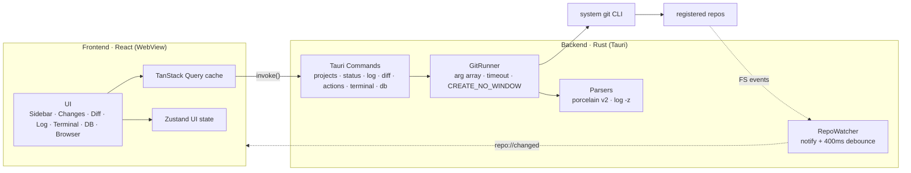

<div align="center">


# Gitpervisor

**여러 로컬 프로젝트를 한 창에서 관제하는 개발 콕핏 — Git 상태, side-by-side diff, 커밋·푸시, LSP 인텔리전스를 갖춘 코드 에디터, 임베디드 터미널, DB 워크스페이스, API 클라이언트, localhost 프리뷰용 내장 브라우저, 그리고 AI 코딩 에이전트가 지금 무슨 작업을 하는지까지 실시간으로 감지합니다.**

_“JetBrains 커밋 툴윈도우 × Windows Terminal × DB 클라이언트”를 멀티-레포로, IDE 없이._

<br/>

[](LICENSE)
[](https://tauri.app)
[](https://react.dev)
[](https://www.rust-lang.org)


[](https://github.com/imtelloper/gitpervisor/releases/latest)

<br/>

[English](README.md) · **한국어**

[**기능**](#-주요-기능) · [**다운로드**](#-다운로드) · [**소스 빌드**](#-소스에서-빌드) · [**단축키**](#️-키보드-단축키) · [**아키텍처**](#️-아키텍처)

</div>

<br/>

<div align="center">

[](designs/main-screen-v2.png)

<sub>프로젝트 레일 · Changes 패널 · Monaco side-by-side diff · 임베디드 터미널 · Log 패널 — 모두 한 창에서</sub>

</div>

---

## 왜 Gitpervisor인가

진행 중인 프로젝트가 여러 개라면, 매일 **각 프로젝트 열기 → `git status` 확인 → diff 보기 → 커밋 → 푸시**를 반복하게 됩니다. 그렇다고 프로젝트마다 무거운 IDE를 띄우는 건 느리고, 터미널 탭을 잔뜩 열어두면 어느 레포가 무슨 상태인지 놓칩니다.

Gitpervisor는 그 루프를 **하나의 가벼운 창**으로 압축하고, 한 발 더 나갑니다 — 터미널에서 돌고 있는 **AI 코딩 에이전트**까지 감시해서, 어떤 프로젝트가 아직 작업 중이고 어떤 게 끝났는지 한눈에 보여줍니다.

- 📁 경로로 등록한 **모든 레포의 상태를 사이드바에서 한눈에** — 브랜치 · ahead/behind · 변경 카운트 · 충돌
- 🤖 **AI 에이전트 작업 배지** — *Claude Code* 턴이 아직 도는 프로젝트와 끝난 프로젝트를 구분하고, 끝나면 **에이전트의 마지막 메시지를 담은** OS / Slack / 이메일 알림 수신
- 🔍 프로젝트 클릭 → **변경 파일 + side-by-side diff 즉시 확인**
- ✅ 그 자리에서 **stage → commit → push**, 진행 상황 실시간 스트리밍
- 📝 **파일을 그 자리에서 편집** — 11개 언어 계열에서 LSP 자동완성·진단·정의 이동을 지원하는 Monaco 에디터
- 🔄 외부 에디터로 저장만 해도 **파일 감시가 사이드바를 자동 갱신**
- ❯_ **진짜 임베디드 터미널**에서 빌드·스크립트 실행, 패널 분할 지원
- 🗄️ 내장 DB 워크스페이스에서 **MongoDB · PostgreSQL · MySQL · SQL Server · SQLite · Redis** 쿼리 — 별도 클라이언트 불필요
- 📡 **Postman 스타일 API 클라이언트**로 엔드포인트 테스트 — 요청이 Rust 백엔드를 거치므로 CORS에 막히지 않음
- 🌐 **localhost 개발 서버 프리뷰** + 웹(GitHub·검색) 탐색을 내장 브라우저 탭에서

> **인증·훅·서명은 건드리지 않습니다.** 모든 git 작업은 시스템 `git` CLI에 위임되므로 credential manager, SSH agent, hooks, commit signing, `.gitconfig`가 **있는 그대로** 동작합니다.

---

## ✨ 주요 기능

### 🤖 AI 에이전트 작업 감지
라이브 터미널 버퍼를 스캔해 프로젝트별로 AI 코딩 에이전트가 **작업 중**인지 **완료**인지 배지로 보여줍니다. *Claude Code*가 한 턴을 처리하는 동안 출력하는 `esc to interrupt` 마커를 기준으로 삼되, 커서 줄만이 아니라 **보이는 화면 전체**를 스캔해서 푸터·plan mode 줄에 속지 않습니다. 다섯 개 레포에 에이전트를 돌려도 어느 게 아직 손이 필요한지 탭을 오가지 않고 바로 압니다.

에이전트가 턴을 마치면 **에이전트의 마지막 메시지를 본문으로 담은 OS 알림**을 띄울 수 있습니다 — 창을 전환하지 않고 토스트에서 작업 결과를 바로 읽습니다. 설정에서 릴레이를 켜면 같은 완료 알림이 **Slack 웹훅**이나 **SMTP 이메일**로도 전달되어, 오래 도는 에이전트 세션을 다른 방에서도 모니터링할 수 있습니다. 상태바의 **Claude 사용량 바**는 Claude Code의 `/usage`와 같은 소스에서 읽어 온 세션(5시간)·주간 사용량을 실시간 표시해, 에이전트가 도는 동안 레이트리밋 여유를 확인할 수 있습니다.

### 🗂️ 멀티 레포 상태 대시보드
폴더를 등록하면 사이드바에 상태 점·브랜치·`↑↓`·변경 카운트가 표시됩니다. 프로젝트 20개도 **병렬 조회로 1초 안에** 전부 갱신됩니다. **중첩 레포도 그냥 동작합니다** — 등록한 프로젝트 안에 포함된 git 레포(일반 `git status`에선 더러운 폴더 한 줄로만 보이는)를 감지해 별도 레포로 표시합니다: 독립된 상태·staging·diff·커밋.

| 상태 점 | 의미 |
|:------:|------|
| 🟢 초록 | clean — 변경 없음, 푸시할 것 없음 |
| 🟡 노랑 | 변경 있음 또는 ahead/behind 존재 |
| 🔴 빨강 | 충돌 / merge·rebase 진행 중 |
| ⚫ 회색 | 경로 소실 · git 오류 |

### 🔍 Side-by-side Diff 뷰어
**Monaco `DiffEditor`** 기반 — 구문 하이라이트, 단어 단위 인트라라인 하이라이트, **변경 없는 영역 접기**(`hideUnchangedRegions`)를 전부 내장. 인덱스 ↔ 워킹 트리, staged(HEAD ↔ index), 커밋별 diff를 모두 지원하며 바이너리·대용량(1.5MB) 파일은 안전하게 가드합니다. untracked 파일은 온통 초록인 가짜 diff 대신 **일반 내용 뷰**로 열립니다 — 없는 것과의 diff가 아니라 새 파일 자체를 읽습니다.

### 📝 코드 에디터 · LSP
파일 뷰어가 진짜 에디터로 성장했습니다. 트리에서 아무 파일이나 열어 **Monaco**에서 편집하고 **Ctrl+S**로 저장합니다(저장 시 포맷 옵션). 내장 **LSP 클라이언트**가 **11개 언어 계열** — TypeScript/JavaScript, Python, PHP, C/C++, Rust, Zig, Go, Ruby, C#, Java, Lua — 에서 자동완성·진단·호버·**정의로 이동**을 제공하며, 언어 서버는 언어별로 자동 다운로드·버전 고정됩니다(`gopls`처럼 툴체인이 관리하는 것은 PATH에서 탐색). 탐색도 IDE급입니다: **퀵오픈**(`mod+P`), **심볼 검색**(`mod+Alt+N`), **Find in Files**(`mod+Shift+F`).

### ✅ 커밋 워크플로우
체크박스 staging → 커밋 메시지 → **Commit / Commit and Push** (+ Amend). discard(변경 되돌리기·untracked 삭제)는 확인 다이얼로그를 거치고 `autocrlf` 환경에서도 안전합니다. Fetch / Pull / Push는 진행 상황을 라인 단위로 스트리밍하고, 업스트림이 없으면 `-u` 푸시를 안내합니다.

### 🔄 실시간 자동 갱신
파일시스템 감시(`notify` + 400ms 디바운스)로 **외부 에디터 저장을 감지**해 사이드바 뱃지와 Changes 목록을 실시간 반영합니다. `.git/objects`·`*.lock`은 무시해 빌드 산출물 폭주에 휩쓸리지 않습니다.

### 🌿 히스토리 · Log 패널
하단 접이식 Log 패널 3분할 — **브랜치 트리(local/remote) · 커밋 리스트 · 커밋 상세(파일 트리 + 전체 메시지)**. 커밋의 파일을 클릭하면 그 커밋 기준 diff가 중앙 뷰어에 표시됩니다. 페이지네이션으로 수천 개 커밋도 매끄럽게.

### ❯_ 임베디드 터미널 + 탭 워크스페이스
프로젝트 경로에서 바로 셸을 띄웁니다 — **`portable-pty`(ConPTY) + `@xterm/xterm`** 으로 oh-my-posh 프롬프트·ANSI·`vim`까지 동작하는 진짜 의사터미널. 중앙 뷰어는 `[📄 Viewer] [❯_ pwsh] [🌐 Browser] [＋]` 탭으로 전환되고, **Windows Terminal 스타일 패널 분할**(상하/좌우, 드래그 리사이즈, 최대화)을 지원합니다. 탭을 바꿔도 PTY는 Rust에 살아있어 스크롤백이 유지됩니다.

### 🧮 터미널 모아보기
**`mod+Shift+A`**를 누르면 모든 프로젝트에 걸쳐 열려 있는 터미널 전부가 한 화면 분할로 타일링되고, 각 패널에 프로젝트 이름과 실시간 AI 작업 상태가 표시됩니다. 에이전트 감지의 자연스러운 짝입니다: 다섯 개 레포에서 Claude Code를 돌리고 모아보기를 열면 전부가 동시에 굴러가는 걸 한 화면에서 지켜볼 수 있습니다. 헤더에서 아무 프로젝트에나 새 터미널을 바로 추가하고, 파일을 열면 일반 뷰어로 돌아갑니다.

### 🗄️ 데이터베이스 워크스페이스
**Monaco 에디터** · 연결 사이드바 · 결과 그리드를 갖춘 내장 쿼리 워크스페이스. **MongoDB · PostgreSQL · MySQL · SQL Server · SQLite · Redis**를 모두 지원합니다(SQL Server는 예상 실행 계획 포함). 연결에 **읽기 전용**을 지정할 수 있고 — UI만이 아니라 Rust 백엔드에서 강제 — SQL 결과 그리드는 기본키 기준 셀 인라인 편집과 행 삭제를 지원합니다. 콕핏을 떠나지 않고 앱의 DB를 바로 조회하세요.

### 📡 API 클라이언트
터미널·DB 워크스페이스 옆 탭에 **Postman 스타일 API 클라이언트**가 있습니다: 메서드·헤더·파라미터와 **Monaco 바디 에디터**로 요청을 만들고, **컬렉션**으로 정리하고, **환경 변수**로 값을 템플릿화하고, 인증을 붙입니다. 요청은 webview가 아니라 **Rust 백엔드**가 실행하므로 CORS 간섭이 없고, 응답은 구조화된 패널로 렌더됩니다. 방금 작성한 엔드포인트를 콕핏을 떠나지 않고 테스트하세요.

### 🌐 임베디드 브라우저
Viewer / DB / 터미널과 나란히 놓이는 브라우저 탭 — 뒤로/앞으로/새로고침, 옴니박스, 북마크, 다운로드 정책을 갖췄습니다. **호스트로 경로를 자동 분기**합니다: `localhost`·`127.0.0.1` 개발 서버는 DOM 내부 `<iframe>`으로(분할·모달·포커스에 완전 통합), GitHub·검색 같은 외부 사이트는 **네이티브 child webview**로 렌더 — `X-Frame-Options`로 프레임을 막는 사이트도 열립니다. 팝업도 진짜 브라우저처럼 동작합니다: `window.open` / `target=_blank` / **OAuth 로그인 창**이 `opener`/`postMessage` 관계를 유지하는 플로팅 앱 창으로 열려 서드파티 로그인이 앱 안에서 완료되고, 로그인 상태는 앱의 권한 있는 webview와 의도적으로 격리된 브라우저 프로필에 저장되어 **재시작 후에도 유지**됩니다.

### 🔁 자동 업데이트
Gitpervisor는 스스로를 최신으로 유지합니다. **설정 › 업데이트**에서 GitHub Releases를 확인하고 **원클릭**으로 새 버전을 설치합니다 — 다운로드, 검증, 재시작까지. 모든 업데이트 아티팩트는 **암호학적으로 서명**(minisign)되며 적용 전에 앱에 고정(pin)된 공개키로 검증되므로, 업데이터는 이 레포에서 실제로 릴리스된 버전만 설치합니다.

### 📊 리소스 모니터
타이틀바의 **CPU / GPU / RAM** 게이지를 클릭하면 작업 관리자급 팝업 창이 열립니다: 프로세스별 **CPU·RAM·디스크 처리량·GPU** 사용량을 실제 프로세스 아이콘과 함께 보여주고, 실시간 검색, 정렬 가능한 컬럼, 우클릭 메뉴의 **작업 끝내기**(단일 프로세스 또는 트리 전체)까지 지원합니다. 어떤 dev 서버·빌드·에이전트가 머신을 잡아먹는지 가려낼 때 유용합니다.

### 🧩 그 외
**파일 트리**가 실제 일을 합니다: Ctrl/Cmd·Shift 범위 다중 선택, **이미지 일괄 변환**(png/jpg/webp… 덮어쓰기 확인 포함), 내장 **이미지 에디터**, `.exe`/`.bat` 파일 즉석 실행, OS로 드래그해 파일 복사 · 영속되는 **프로젝트별 메모** · **프로젝트 관리 편의 기능** — 프로젝트 폴더를 옮겼다면? 재등록 대신 사이드바 우클릭 메뉴에서 경로 수정; PROJECTS 헤더에서 새 프로젝트 폴더(아직 git이 아니어도) 생성; 프로젝트마다 트리 펼침 상태와 열린 파일을 각자 기억 · **`.env` 파일 하이라이트 지원**(ini 토크나이저 — 키·값·`#` 주석) · **macOS quarantine 스캐너** — `com.apple.quarantine`이 찍힌 개발 도구를 찾아 설정에서 해제 · **Rust `target/` 용량 관리** — 프로젝트별 빌드 디렉터리가 몇 GB를 붙잡고 있는지 확인하고 원클릭 `cargo clean` · **크래시 로깅** — Rust 패닉과 처리되지 않은 프론트엔드 오류를 로그 파일에 기록 · `<html data-theme>` + CSS 변수 기반 **6개 테마(Darcula · Monokai · Dracula · Nord · Light · Solarized Light)**, diff·터미널 폰트 크기 조절 가능.

---

## 📦 다운로드

[**Releases**](https://github.com/imtelloper/gitpervisor/releases/latest) 페이지에서 OS에 맞는 최신 설치본을 받으세요:

| OS | 파일 |
|----|------|
| **Windows** | `.exe` (NSIS 설치 → Program Files + 바로가기) |
| **macOS** | `.dmg` (universal — Apple Silicon + Intel) |
| **Linux** | `.AppImage` (포터블) · `.deb` (Debian/Ubuntu) · `.rpm` (Fedora/RHEL) |

> **`git ≥ 2.35` 가 PATH에 있어야 합니다** — 앱이 시스템 git CLI를 사용합니다. git이 없으면 조용히 실패하지 않고 시작 시점에 안내 화면을 띄웁니다.
>
> 설치본은 아직 OS 코드 서명이 되어 있지 않아, 첫 실행 시 Windows SmartScreen("추가 정보 → 실행")이나 macOS Gatekeeper(우클릭 → 열기)가 경고할 수 있습니다. 다만 **자동 업데이트는 암호학적으로 서명**(minisign)되며 설치 전에 앱에 고정된 공개키로 검증됩니다.

---

## 🚀 소스에서 빌드

### 요구 사항

- **Node.js 18+** / npm
- **Rust** (stable) — <https://rustup.rs>
- **git ≥ 2.35** 가 PATH에 존재
- Linux 한정: `libwebkit2gtk-4.1-dev`, `libssl-dev` 등 Tauri 시스템 의존성 (전체 apt 목록은 [워크플로우](.github/workflows/release.yml) 참조)

### 개발 실행

```sh
npm install
npm run tauri dev
```

### 빌드

```sh
npm run tauri build
```

### 테스트

```sh
cd src-tauri && cargo test   # porcelain v2 parser fixture tests
npm run build                # tsc typecheck + vite bundle
```

---

## ⌨️ 키보드 단축키

JetBrains 커밋 툴윈도우와 동일한 배치를 따릅니다. `mod` = macOS는 `Cmd`, 그 외는 `Ctrl`.

| 단축키 | 동작 |
|--------|------|
| `F5` | 전체 프로젝트 새로고침 |
| `mod` + `K` | 커밋 |
| `mod` + `Shift` + `K` | 푸시 |
| `mod` + `T` | Pull |
| <code>mod</code> + <code>`</code> | 터미널 토글 (Viewer ↔ 터미널) |
| `mod` + `P` | 퀵오픈 (파일 퍼지 검색) |
| `mod` + `Shift` + `F` | Find in Files |
| `mod` + `Alt` + `N` | 심볼 검색 (Go to Symbol) |
| `mod` + `S` | 에디터에서 파일 저장 |
| `mod` + `W` | 파일 탭 / 터미널 패널 닫기 |
| `mod` + `Shift` + `A` | 터미널 모아보기 토글 |
| `mod` + `Shift` + `D` | 활성 패널 오른쪽 분할 |
| `mod` + `Shift` + `E` | 활성 패널 아래 분할 |
| `mod` + `Shift` + `W` | 활성 패널 닫기 |

---

## 🏗️ 아키텍처

**원칙 세 가지**

- **Rust = 데이터 소스의 단일 진실.** git 출력 파싱은 전부 Rust에서 끝내고, 프론트엔드는 구조화된 JSON만 받습니다.
- **읽기는 병렬, 쓰기는 레포당 직렬.** status/log/diff는 동시 실행, commit/push/stage 같은 변경 작업은 레포별 `Mutex`로 큐잉합니다(서로 다른 레포끼리는 병렬).
- **이벤트 → 무효화 → 재조회.** 백엔드는 "이 레포 바뀜"만 알리고, 프론트는 해당 Query 캐시를 invalidate — 페이로드에 상태를 싣지 않아 레이스가 없습니다.



### 왜 libgit2가 아니라 git CLI인가

| 관점 | git CLI ✅ | libgit2 |
|------|-----------|---------|
| 인증 (push/pull) | credential manager·SSH agent **자동 동작** | 콜백 직접 구현 — Windows 최대 고통 지점 |
| hooks / signing / `.gitconfig` | 전부 그대로 동작 | 부분 지원 또는 미지원 |
| Windows 빌드 | 추가 의존성 없음 | openssl/vcpkg 이슈 빈번 |
| 파싱 | `--porcelain=v2 -z` 안정 포맷 공식 제공 | 구조체 직접 반환 |

→ GitHub Desktop(dugite)과 동일한 접근. 파싱의 단점은 porcelain 포맷이 해결하고, 인증·훅·서명이 공짜로 따라옵니다.

📐 전체 설계·IPC 계약·엣지케이스는 **[DOCS/DESIGN.md](DOCS/DESIGN.md)** 참조.

---

## 🧰 기술 스택

| 레이어 | 선택 |
|--------|------|
| 데스크톱 셸 | **Tauri 2** (Rust) |
| 프론트엔드 | **React 19** + TypeScript + Vite 7 |
| 에디터 (코드 · diff · SQL) | **Monaco Editor** |
| 언어 인텔리전스 | **LSP** — 언어별 서버 자동 프로비저닝 (11개 언어 계열) |
| 상태 관리 | **Zustand** (UI) + **TanStack Query v5** (git 데이터) |
| 스타일 | **Tailwind CSS 4** (테마 토큰 6세트) |
| 터미널 | **portable-pty** (ConPTY) + **@xterm/xterm** (+ webgl) |
| 브라우저 | **wry** 네이티브 child webview (`unstable`) + `<iframe>` |
| 파일 감시 | **notify-debouncer-full** (Rust) |
| 데이터베이스 | **mongodb** + **tiberius** (SQL Server) + **sqlx** (PostgreSQL/MySQL/SQLite) + **redis** |
| 영속화 | **tauri-plugin-store** (`projects.json` / `settings.json`) |
| 업데이트 | **tauri-plugin-updater** — minisign 서명 아티팩트, 고정 공개키 |
| Git 연동 | **시스템 git CLI** (`--porcelain=v2 -z`) |

---

## 🔒 보안 · 설계 철학

- **셸 인젝션 불가 구조** — `GitRunner` 단일 관문에서 인자 배열로만 실행, 경로는 항상 `--` 뒤에 배치. 커밋 메시지는 `-F -`(stdin)로 전달해 인자 인젝션 표면 자체가 없습니다.
- **앱이 사용자 동의 없이 레포를 변경하지 않음** — 모든 쓰기(commit / push / pull / stage / discard)는 명시적 버튼입니다. 백그라운드 `git fetch`는 오직 ↑↓ 배지를 최신으로 유지하기 위해 5분마다 실행되며(설정에서 주기를 0으로 두면 비활성화), fetch는 워킹 트리를 절대 바꾸지 않는 유일한 원격 명령입니다.
- **토큰·비밀번호를 저장하거나 다루지 않음** — 인증은 전적으로 git 스택에 위임.
- **앱 webview에 엄격한 CSP** — `default-src 'self'`, 원격 스크립트 없음. 외부 웹 콘텐츠는 IPC 브리지가 없는 격리된 child webview에서만 렌더됩니다.
- **강화된 IPC 표면** — 레포 파일 경로는 정규화·컨테인먼트 검사를 거치고, DB 읽기 전용 모드는 Rust에서 강제되며, 릴리스 CI는 서드파티 액션을 커밋 SHA로 고정합니다.
- **콘솔 깜빡임 없음** (Windows `CREATE_NO_WINDOW`), **인증 프롬프트 행 방지** (`GIT_TERMINAL_PROMPT=0`).

---

## 🗺️ 로드맵

- [x] 코어 뷰어 · 멀티 레포 상태 · worktree diff
- [x] 커밋 워크플로우 · push/pull/fetch 진행 스트리밍 · watcher 자동 갱신
- [x] 히스토리 · Log 패널 · 커밋별·staged diff
- [x] 임베디드 터미널 · 뷰어 탭 · 패널 분할 · 모아보기
- [x] AI 에이전트 작업 감지 · 완료 알림 (OS / Slack / 이메일)
- [x] 데이터베이스 워크스페이스 (MongoDB · PostgreSQL · MySQL · SQL Server · SQLite · Redis)
- [x] 임베디드 브라우저 (localhost 프리뷰 + 외부 사이트 · 북마크 · OAuth 팝업)
- [x] LSP 코드 에디터 (11개 언어 계열) · 퀵오픈 · Find in Files
- [x] API 클라이언트 (컬렉션 · 환경 변수 · Rust 측 HTTP)
- [x] 서명된 아티팩트 기반 자동 업데이트
- [ ] OS 코드 서명 설치본 (SmartScreen / Gatekeeper 경고 없는 첫 실행)
- [ ] Claude Code 외 AI 에이전트 시그널 확장

**비범위 (현재 의도적 제외 — YAGNI):** 머지 충돌 해결 UI · 인터랙티브 리베이스 · 커밋 그래프 레인 · GitHub/GitLab API.

---

## 🤝 기여

이슈와 PR을 환영합니다. 시작하기 좋은 영역: DB 엔진 추가, AI 에이전트 작업 시그널 확장, 플랫폼별 터미널 수정. 큰 변경은 PR 전에 이슈로 먼저 논의해 주세요. 아키텍처와 IPC 계약은 **[DOCS/DESIGN.md](DOCS/DESIGN.md)**, 빌드 문제는 **[DOCS/TROUBLESHOOTING.md](DOCS/TROUBLESHOOTING.md)** 를 참고하세요.

---

## 📄 라이선스

[MIT](LICENSE) © imtelloper — 쓰고, 포크하고, 배포하세요.

<div align="center">
<br/>
<sub>Built with 🦀 Tauri · React · Rust</sub>
</div>
