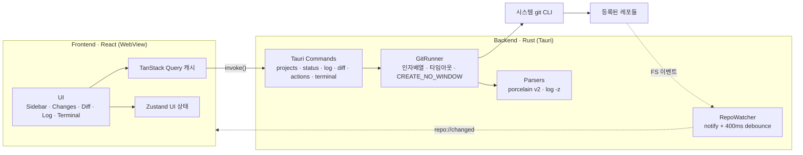

<div align="center">


# Gitpervisor

**여러 로컬 프로젝트의 git 상태를 한 화면에서 감시하고, diff 확인 → 커밋 → 푸시까지 끝내는 멀티 레포 Git 대시보드 데스크톱 앱.**

_“JetBrains 커밋 툴윈도우의 멀티-레포 버전, IDE 없이.”_

<br/>

[](https://tauri.app)
[](https://react.dev)
[](https://www.typescriptlang.org)
[](https://www.rust-lang.org)
[](https://tailwindcss.com)


<br/>

[**기능**](#-주요-기능) · [**시작하기**](#-시작하기) · [**단축키**](#️-키보드-단축키) · [**아키텍처**](#-아키텍처) · [**로드맵**](#-로드맵)

</div>

<br/>

<div align="center">

[](designs/main-screen-v2.png)

<sub>프로젝트 레일 · Changes 패널 · Monaco side-by-side diff · 하단 Log 패널 — 모두 한 창에서</sub>

</div>

---

## 왜 Gitpervisor인가

진행 중인 프로젝트가 여러 개라면, 매일 **각 프로젝트 열기 → `git status` 확인 → diff 보기 → 커밋 → 푸시**를 반복하게 됩니다. 그렇다고 프로젝트마다 무거운 IDE를 띄우는 건 느립니다.

Gitpervisor는 그 일상 루프를 **하나의 가벼운 창**으로 압축합니다.

- 📁 경로로 등록한 **모든 레포의 상태를 사이드바에서 한눈에** — 브랜치 · ahead/behind · 변경 카운트 · 충돌
- 🔍 프로젝트 클릭 → **변경 파일 + side-by-side diff 즉시 확인**
- ✅ 그 자리에서 **stage → commit → push**, 진행 상황 실시간 스트리밍
- 🔄 외부 에디터로 저장만 해도 **파일 감시가 사이드바를 자동 갱신**
- ⌨️ 앱을 떠나지 않고 **임베디드 터미널**에서 빌드·스크립트 실행

> **인증·훅·서명은 건드리지 않습니다.** 모든 git 작업은 시스템 `git` CLI에 위임되므로 credential manager, SSH agent, hooks, commit signing, `.gitconfig`가 **있는 그대로** 동작합니다.

---

## ✨ 주요 기능

### 🗂️ 멀티 레포 상태 대시보드
폴더를 등록하면 사이드바에 상태 점·브랜치·`↑↓`·변경 카운트가 표시됩니다. 프로젝트 20개도 **병렬 조회로 1초 안에** 전부 갱신됩니다.

| 상태 점 | 의미 |
|:------:|------|
| 🟢 초록 | clean — 변경 없음, 푸시할 것 없음 |
| 🟡 노랑 | 변경 있음 또는 ahead/behind 존재 |
| 🔴 빨강 | 충돌 / merge·rebase 진행 중 |
| ⚫ 회색 | 경로 소실 · git 오류 |

### 🔍 Side-by-side Diff 뷰어
**Monaco `DiffEditor`** 기반 — 구문 하이라이트, 단어 단위 인트라라인 하이라이트, **변경 없는 영역 접기**(`hideUnchangedRegions`)를 전부 내장. 인덱스 ↔ 워킹 트리, staged(HEAD ↔ index), 커밋별 diff를 모두 지원하며 바이너리·대용량(1.5MB) 파일은 안전하게 가드합니다.

### ✅ 커밋 워크플로우
체크박스 staging → 커밋 메시지 → **Commit / Commit and Push** (+ Amend). discard(변경 되돌리기·untracked 삭제)는 확인 다이얼로그를 거치고 `autocrlf` 환경에서도 안전합니다. Fetch / Pull / Push는 진행 상황을 라인 단위로 스트리밍하고, 업스트림이 없으면 `-u` 푸시를 안내합니다.

### 🔄 실시간 자동 갱신
파일시스템 감시(`notify` + 400ms 디바운스)로 **외부 에디터 저장을 감지**해 사이드바 뱃지와 Changes 목록을 실시간 반영합니다. `.git/objects`·`*.lock`은 무시해 빌드 산출물 폭주에 휩쓸리지 않습니다.

### 🌿 히스토리 · Log 패널
하단 접이식 Log 패널 3분할 — **브랜치 트리(local/remote) · 커밋 리스트 · 커밋 상세(파일 트리 + 전체 메시지)**. 커밋의 파일을 클릭하면 그 커밋 기준 diff가 중앙 뷰어에 표시됩니다. 페이지네이션으로 수천 개 커밋도 매끄럽게.

### ❯_ 임베디드 터미널 + 탭 워크스페이스
프로젝트 경로에서 바로 셸을 띄웁니다 — **`portable-pty`(ConPTY) + `@xterm/xterm`** 으로 oh-my-posh 프롬프트·ANSI·`vim`까지 동작하는 진짜 의사터미널. 중앙 뷰어는 `[📄 Viewer] [❯_ pwsh] [＋]` 탭으로 전환되고, **Windows Terminal 스타일 패널 분할**(상하/좌우, 드래그 리사이즈, 최대화)을 지원합니다. 탭을 바꿔도 PTY는 Rust에 살아있어 스크롤백이 유지됩니다.

### 🎨 테마
**Darcula**(기본 다크) · **Monokai** — `<html data-theme>` + CSS 변수로 전체 팔레트를 전환합니다. diff·터미널 폰트 크기도 설정에서 조절 가능.

---

## 🚀 시작하기

### 요구 사항

- **Node.js 18+** / npm
- **Rust** (stable) — <https://rustup.rs>
- **git ≥ 2.35** 가 PATH에 존재 (앱이 시스템 git CLI를 사용)
  - 미설치 시 앱 시작 시점에 감지해 안내 화면을 띄웁니다.

### 개발 실행

```sh
npm install
npm run tauri dev
```

### 빌드

```sh
npm run tauri build
```

### 테스트

```sh
cd src-tauri && cargo test   # porcelain v2 파서 픽스처 테스트
npm run build                # tsc 타입체크 + vite 번들
```

---

## ⌨️ 키보드 단축키

JetBrains 커밋 툴윈도우와 동일한 배치를 따릅니다.

| 단축키 | 동작 |
|--------|------|
| `F5` | 전체 프로젝트 새로고침 |
| `Ctrl` + `K` | 커밋 |
| `Ctrl` + `Shift` + `K` | 푸시 |
| `Ctrl` + `T` | Pull |
| <code>Ctrl</code> + <code>`</code> | 터미널 토글 (Viewer ↔ 터미널) |
| `Ctrl` + `Shift` + `D` | 활성 패널 오른쪽 분할 |
| `Ctrl` + `Shift` + `E` | 활성 패널 아래 분할 |
| `Ctrl` + `Shift` + `W` | 활성 패널 닫기 |

---

## 🏗️ 아키텍처

**원칙 세 가지**

- **Rust = 데이터 소스의 단일 진실.** git 출력 파싱은 전부 Rust에서 끝내고, 프론트엔드는 구조화된 JSON만 받습니다.
- **읽기는 병렬, 쓰기는 레포당 직렬.** status/log/diff는 동시 실행, commit/push/stage 같은 변경 작업은 레포별 `Mutex`로 큐잉합니다(서로 다른 레포끼리는 병렬).
- **이벤트 → 무효화 → 재조회.** 백엔드는 "이 레포 바뀜"만 알리고, 프론트는 해당 Query 캐시를 invalidate — 페이로드에 상태를 싣지 않아 레이스가 없습니다.



### 왜 libgit2가 아니라 git CLI인가

| 관점 | git CLI ✅ | libgit2 |
|------|-----------|---------|
| 인증 (push/pull) | credential manager·SSH agent **자동 동작** | 콜백 직접 구현 — Windows 최대 고통 지점 |
| hooks / signing / `.gitconfig` | 전부 그대로 동작 | 부분 지원 또는 미지원 |
| Windows 빌드 | 추가 의존성 없음 | openssl/vcpkg 이슈 빈번 |
| 파싱 | `--porcelain=v2 -z` 안정 포맷 공식 제공 | 구조체 직접 반환 |

→ GitHub Desktop(dugite)과 동일한 접근. 파싱의 단점은 porcelain 포맷이 해결하고, 인증·훅·서명이 공짜로 따라옵니다.

📐 전체 설계·IPC 계약·엣지케이스는 **[DOCS/DESIGN.md](DOCS/DESIGN.md)** 참조.

---

## 🧰 기술 스택

| 레이어 | 선택 |
|--------|------|
| 데스크톱 셸 | **Tauri 2** (Rust) |
| 프론트엔드 | **React 19** + TypeScript + Vite 7 |
| Diff 뷰어 | **Monaco Editor** (`DiffEditor`) |
| 상태 관리 | **Zustand** (UI) + **TanStack Query v5** (git 데이터) |
| 스타일 | **Tailwind CSS 4** (Darcula / Monokai 토큰) |
| 터미널 | **portable-pty** (ConPTY) + **@xterm/xterm** (+ webgl) |
| 파일 감시 | **notify-debouncer-full** (Rust) |
| 영속화 | **tauri-plugin-store** (`projects.json` / `settings.json`) |
| Git 연동 | **시스템 git CLI** (`--porcelain=v2 -z`) |

---

## 🔒 보안 · 설계 철학

- **셸 인젝션 불가 구조** — `GitRunner` 단일 관문에서 인자 배열로만 실행, 경로는 항상 `--` 뒤에 배치. 커밋 메시지는 `-F -`(stdin)로 전달해 인자 인젝션 표면 자체가 없습니다.
- **앱이 사용자 동의 없이 레포를 변경하지 않음** — 자동 fetch는 기본 OFF, 모든 쓰기는 명시적 버튼.
- **토큰·비밀번호를 저장하거나 다루지 않음** — 인증은 전적으로 git 스택에 위임.
- **Tauri capability 최소화** — dialog·opener·store와 자체 커맨드만 허용, 원격 콘텐츠 로드 없음.
- **콘솔 깜빡임 없음** (Windows `CREATE_NO_WINDOW`), **인증 프롬프트 행 방지** (`GIT_TERMINAL_PROMPT=0`).

---

## 🗺️ 로드맵

모든 마일스톤은 독립 배포 가능 상태로 종료됩니다 (부분 기능 금지).

- [x] **M1 — 코어 뷰어** · 프로젝트 추가/영속화, git 감지 게이트, 상태 뱃지, Changes 목록, worktree diff
- [x] **M2 — 커밋 워크플로우** · stage/unstage/discard, commit/amend, push/pull/fetch + 진행 스트리밍, watcher 자동 갱신
- [x] **M3 — 히스토리** · Log 패널 3분할, 페이지네이션, 커밋 diff, staged diff 모드
- [x] **M4 — 폴리시** · 설정, 옵트인 자동 fetch, 단축키, 탐색기/터미널 열기
- [x] **M5 — 임베디드 터미널 + 탭** · ConPTY 터미널, 뷰어 탭, 다중 터미널, 패널 분할

**비범위 (v1 의도적 제외 — YAGNI):** 머지 충돌 해결 UI · 인터랙티브 리베이스 · 커밋 그래프 레인 · GitHub/GitLab API · 파일 편집(뷰어 전용).

---

## 📂 디렉토리 구조

```
gitpervisor/
├── DOCS/DESIGN.md          # 전체 설계 문서 (아키텍처 · IPC 계약 · 엣지케이스)
├── designs/                # UI 시안
├── src-tauri/              # Rust 백엔드
│   ├── src/
│   │   ├── git/            # GitRunner · porcelain/log 파서 · types
│   │   ├── commands/       # projects · status · log · diff · actions · terminal
│   │   └── watcher.rs      # notify 파일 감시
│   └── tauri.conf.json
└── src/                    # React 프론트엔드
    ├── components/         # sidebar · changes · diff · log · workspace ...
    ├── queries/            # TanStack Query 훅
    ├── stores/             # Zustand (ui · terminals · ops)
    └── lib/                # ipc · events · language-map
```

---

## 📄 라이선스

개인 프로젝트로, 현재 별도의 오픈소스 라이선스를 지정하지 않았습니다. 사용·기여 문의는 저장소 이슈로 남겨 주세요.

<div align="center">
<br/>
<sub>Built with 🐰 Tauri · React · Rust</sub>
</div>
