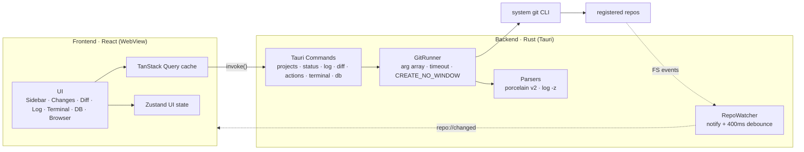

<div align="center">


# Gitpervisor

**A developer cockpit that supervises all your local projects from one window — Git status, side-by-side diffs, commit & push, a code editor with LSP intelligence, an embedded terminal, a database workspace, an API client, a built-in browser for localhost previews, and live detection of what your AI coding agents are doing.**

_Think “JetBrains commit tool window × Windows Terminal × a DB client,” but multi-repo and IDE-free._

<br/>

[](LICENSE)
[](https://tauri.app)
[](https://react.dev)
[](https://www.rust-lang.org)


[](https://github.com/imtelloper/gitpervisor/releases/latest)

<br/>

**English** · [한국어](README.ko.md)

[**Features**](#-features) · [**Download**](#-download) · [**Build from source**](#-build-from-source) · [**Shortcuts**](#️-keyboard-shortcuts) · [**Architecture**](#️-architecture)

</div>

<br/>

<div align="center">

[](designs/main-screen-v2.png)

<sub>Project rail · Changes panel · Monaco side-by-side diff · embedded terminal · Log panel — all in one window</sub>

</div>

---

## Why Gitpervisor

If you juggle several projects at once, your day is a loop: **open a project → run `git status` → read the diff → commit → push** — then do it again for the next repo. Spinning up a heavy IDE for each one is slow, and a pile of terminal tabs loses track of which repo is in what state.

Gitpervisor collapses that loop into **one lightweight window**, and then goes a step further: it also watches the **AI coding agents** you have running in its terminals, so you can see at a glance which projects are still working and which are done.

- 📁 **Every registered repo at a glance** in the sidebar — branch · ahead/behind · change count · conflicts
- 🤖 **AI agent activity badges** — see which projects have a *Claude Code* turn still running vs. finished, and get an OS / Slack / email ping **with the agent's final message** when it's done
- 🔍 Click a project → **changed files + side-by-side diff instantly**
- ✅ **stage → commit → push** right there, with live progress streaming
- 📝 **Edit files in place** — Monaco editor with LSP completions, diagnostics, and Go to Definition across 11 language families
- 🔄 Save in any external editor and the **file watcher auto-refreshes** the sidebar
- ❯_ Run builds and scripts in a **real embedded terminal** with split panes
- 🗄️ Query **MongoDB · PostgreSQL · MySQL · SQL Server · SQLite · Redis** in a built-in DB workspace — no separate client
- 📡 Test your endpoints in a **Postman-style API client** — requests run through the Rust backend, so CORS never gets in the way
- 🌐 **Preview your localhost dev server** and browse the web (GitHub, search) in a built-in browser tab

> **It never touches auth, hooks, or signing.** Every git operation is delegated to your system `git` CLI, so your credential manager, SSH agent, hooks, commit signing, and `.gitconfig` all work **exactly as they already do**.

---

## ✨ Features

### 🤖 AI agent activity detection
Gitpervisor scans the live terminal buffers and surfaces a per-project badge showing whether an AI coding agent is **working** or **done**. It keys off the `esc to interrupt` marker that *Claude Code* prints while processing a turn, scanning the full visible screen (not just the cursor line) so footers and plan-mode lines don't fool it. Run agents across five repos and tell at a glance which ones still need you — no tab-hopping.

When an agent finishes a turn, Gitpervisor can fire an **OS notification whose body is the agent's final message** — you read the result from the toast without switching windows. Turn on the relays in Settings and the same completion pings a **Slack webhook** or **SMTP email**, so long-running agent sessions are monitorable from another room. A **Claude usage bar** in the status bar shows live session (5 h) and weekly usage, read from the same source as Claude Code's `/usage`, so you see rate-limit headroom while agents run.

### 🗂️ Multi-repo status dashboard
Register folders and the sidebar shows a status dot, branch, `↑↓`, and change count per repo. Twenty projects refresh **in under a second** via parallel queries. **Nested repos just work** — a git repo embedded inside a registered project (which plain `git status` shows as a single dirty folder line) is detected and surfaced as its own repo: separate status, staging, diffs, and commits.

| Dot | Meaning |
|:---:|---------|
| 🟢 green | clean — no changes, nothing to push |
| 🟡 yellow | has changes, or ahead/behind |
| 🔴 red | conflict / merge·rebase in progress |
| ⚫ gray | path missing · git error |

### 🔍 Side-by-side diff viewer
Built on **Monaco `DiffEditor`** — syntax highlight, word-level intraline highlight, and **folding of unchanged regions** (`hideUnchangedRegions`) all built in. Index ↔ working tree, staged (HEAD ↔ index), and per-commit diffs are all supported; binary and large files (1.5 MB) are guarded safely. Untracked files open as a **plain content view** rather than a wall-of-green fake diff — you read the new file, not a diff against nothing.

### 📝 Code editor & LSP
The file viewer grew into a real editor. Open any file from the tree, edit it in **Monaco**, and save with **Ctrl+S** (optional format-on-save). A built-in **LSP client** lights up **11 language families** — TypeScript/JavaScript, Python, PHP, C/C++, Rust, Zig, Go, Ruby, C#, Java, Lua — with completions, diagnostics, hover, and **Go to Definition**; servers are auto-downloaded and version-pinned per language (or discovered on your PATH for toolchain-managed ones like `gopls`). Navigation is IDE-grade too: **Quick Open** (`mod+P`), **Go to Symbol** (`mod+Alt+N`), and **Find in Files** (`mod+Shift+F`).

### ✅ Commit workflow
Checkbox staging → commit message → **Commit / Commit and Push** (+ Amend). Discard (revert changes · delete untracked) goes through a confirm dialog and is safe under `autocrlf`. Fetch / Pull / Push stream progress line by line, and offer a `-u` push when there's no upstream.

### 🔄 Real-time auto-refresh
A filesystem watcher (`notify` + 400 ms debounce) **detects saves from external editors** and reflects them in the sidebar badges and the Changes list live. `.git/objects` and `*.lock` are ignored so build output doesn't swamp it.

### 🌿 History & Log panel
A collapsible bottom Log panel split three ways — **branch tree (local/remote) · commit list · commit detail (file tree + full message)**. Click a file in a commit and that commit's diff opens in the center viewer. Pagination keeps thousands of commits smooth.

### ❯_ Embedded terminal + tabbed workspace
Spawns a shell right in the project path — **`portable-pty` (ConPTY) + `@xterm/xterm`**, a real pseudo-terminal where oh-my-posh prompts, ANSI, and `vim` all work. The center viewer switches via `[📄 Viewer] [❯_ pwsh] [🌐 Browser] [＋]` tabs and supports **Windows-Terminal-style splits** (horizontal/vertical, drag-resize, maximize). Switch tabs and the PTY stays alive in Rust, so scrollback is preserved.

### 🧮 Terminal aggregate view
Press **`mod+Shift+A`** and every open terminal — across all your projects — tiles into a single split screen, each pane labeled with its project and live AI-activity state. It's the natural companion to agent detection: run Claude Code in five repos, open the aggregate view, and watch them all grind at once. Add a new terminal to any project straight from the header, or open a file to drop back into the normal viewer.

### 🗄️ Database workspace
A built-in query workspace with a **Monaco editor**, connection sidebar, and result grid. **MongoDB · PostgreSQL · MySQL · SQL Server · SQLite · Redis** are all supported (SQL Server includes an estimated execution plan). Connections can be marked **read-only** — enforced in the Rust backend, not just the UI — and SQL result grids support in-place cell edit and row delete keyed by primary key. Query your app's database without leaving the cockpit.

### 📡 API client
A **Postman-style API client** lives in a tab next to the terminal and DB workspace: build requests with method, headers, params, and a **Monaco body editor**, organize them into **collections**, template values with **environment variables**, and attach auth. Requests are executed by the **Rust backend** — not the webview — so there's no CORS interference, and responses render in a structured panel. Test the endpoint you just wrote without leaving the cockpit.

### 🌐 Embedded browser
A browser tab right next to Viewer / DB / terminal, with back/forward/reload, an omnibox, bookmarks, and a download policy. It **auto-routes by host**: `localhost`/`127.0.0.1` dev servers render in an in-DOM `<iframe>` (fully integrated with splits, modals, and focus), while external sites like GitHub or a search engine render in a **native child webview** — so sites that block framing with `X-Frame-Options` still load. Popups behave like a real browser: `window.open` / `target=_blank` / **OAuth login windows** open as floating app windows that keep the `opener`/`postMessage` relationship, so third-party sign-ins complete in-app, and logins **persist across restarts** in a browser profile deliberately isolated from the app's own privileged webview.

### 🔁 Auto-update
Gitpervisor keeps itself current. **Settings › Updates** checks GitHub Releases and installs a new version in **one click** — download, verify, relaunch. Every update artifact is **cryptographically signed** (minisign) and checked against a public key pinned in the app before it's applied, so the updater will only ever install a release actually cut from this repo.

### 📊 Resource monitor
Click the **CPU / GPU / RAM** gauges in the title bar and a task-manager-grade popup window opens: per-process **CPU, RAM, disk throughput, and GPU** usage with real process icons, live search, sortable columns, and **End task** (single process or the whole tree) from a right-click menu. Handy for telling which dev server, build, or agent is eating the machine.

### 🧩 Extras
The **file tree** does real work: multi-select with Ctrl/Cmd and Shift ranges, **batch image conversion** (png/jpg/webp… with overwrite confirmation), a built-in **image editor**, running `.exe`/`.bat` files in place, and drag-out file copy to the OS · **per-project memos/notes** that persist · **project management niceties** — moved a project folder? Fix its path from the sidebar right-click menu instead of re-registering; create a new project folder (even a not-yet-git one) from the PROJECTS header; each project remembers its own tree expansion and open file · **`.env` files highlight properly** (ini tokenizer — keys, values, `#` comments) · **macOS quarantine scanner** — finds dev tools stamped with `com.apple.quarantine` and clears it from Settings · **Rust `target/` size management** — see how many gigabytes each project's build directory is holding hostage, with one-click `cargo clean` · **crash logging** — Rust panics and unhandled frontend errors land in a log file · **6 themes (Darcula · Monokai · Dracula · Nord · Light · Solarized Light)** via `<html data-theme>` + CSS variables, with adjustable diff and terminal font sizes.

---

## 📦 Download

Grab the latest installer for your OS from the [**Releases**](https://github.com/imtelloper/gitpervisor/releases/latest) page:

| OS | File |
|----|------|
| **Windows** | `.exe` (NSIS installer → Program Files + shortcuts) |
| **macOS** | `.dmg` (universal — Apple Silicon + Intel) |
| **Linux** | `.AppImage` (portable) · `.deb` (Debian/Ubuntu) · `.rpm` (Fedora/RHEL) |

> **Requires `git ≥ 2.35` on your PATH** — the app uses your system git CLI. If git isn't found, Gitpervisor shows a guidance screen on launch instead of failing silently.
>
> Installers aren't OS code-signed yet, so on first launch Windows SmartScreen ("More info → Run anyway") or macOS Gatekeeper (right-click → Open) may warn you. **Auto-updates, however, are cryptographically signed** (minisign) and verified against a public key pinned in the app before install.

---

## 🚀 Build from source

### Requirements

- **Node.js 18+** / npm
- **Rust** (stable) — <https://rustup.rs>
- **git ≥ 2.35** on your PATH
- Linux only: `libwebkit2gtk-4.1-dev`, `libssl-dev`, and the usual Tauri system deps (see [the workflow](.github/workflows/release.yml) for the full apt list)

### Develop

```sh
npm install
npm run tauri dev
```

### Build

```sh
npm run tauri build
```

### Test

```sh
cd src-tauri && cargo test   # porcelain v2 parser fixture tests
npm run build                # tsc typecheck + vite bundle
```

---

## ⌨️ Keyboard shortcuts

Follows the same layout as the JetBrains commit tool window. `mod` = `Cmd` on macOS, `Ctrl` elsewhere.

| Shortcut | Action |
|----------|--------|
| `F5` | Refresh all projects |
| `mod` + `K` | Commit |
| `mod` + `Shift` + `K` | Push |
| `mod` + `T` | Pull |
| <code>mod</code> + <code>`</code> | Toggle terminal (Viewer ↔ terminal) |
| `mod` + `P` | Quick Open (fuzzy file search) |
| `mod` + `Shift` + `F` | Find in Files |
| `mod` + `Alt` + `N` | Go to Symbol |
| `mod` + `S` | Save file in editor |
| `mod` + `W` | Close file tab / terminal pane |
| `mod` + `Shift` + `A` | Toggle terminal aggregate view |
| `mod` + `Shift` + `D` | Split active pane right |
| `mod` + `Shift` + `E` | Split active pane down |
| `mod` + `Shift` + `W` | Close active pane |

---

## 🏗️ Architecture

**Three principles**

- **Rust is the single source of truth for data.** All git-output parsing finishes in Rust; the frontend only ever receives structured JSON.
- **Reads run in parallel, writes are serialized per repo.** status/log/diff run concurrently; mutating ops (commit/push/stage) are queued per repo with a `Mutex` (different repos still run in parallel).
- **Event → invalidate → refetch.** The backend only signals "this repo changed"; the frontend invalidates that query's cache — no state rides on the event payload, so there are no races.



### Why the git CLI instead of libgit2

| Concern | git CLI ✅ | libgit2 |
|---------|-----------|---------|
| Auth (push/pull) | credential manager · SSH agent **just work** | implement callbacks yourself — the #1 pain on Windows |
| hooks / signing / `.gitconfig` | all work as-is | partial or unsupported |
| Windows build | no extra deps | frequent openssl/vcpkg issues |
| Parsing | stable `--porcelain=v2 -z` format, officially provided | returns structs directly |

→ The same approach as GitHub Desktop (dugite). The porcelain format solves the parsing downside, and auth/hooks/signing come for free.

📐 Full design, IPC contracts, and edge cases live in **[DOCS/DESIGN.md](DOCS/DESIGN.md)**.

---

## 🧰 Tech stack

| Layer | Choice |
|-------|--------|
| Desktop shell | **Tauri 2** (Rust) |
| Frontend | **React 19** + TypeScript + Vite 7 |
| Editor (code · diff · SQL) | **Monaco Editor** |
| Language intelligence | **LSP** — servers auto-provisioned per language (11 language families) |
| State | **Zustand** (UI) + **TanStack Query v5** (git data) |
| Styling | **Tailwind CSS 4** (6 theme token sets) |
| Terminal | **portable-pty** (ConPTY) + **@xterm/xterm** (+ webgl) |
| Browser | **wry** native child webview (`unstable`) + `<iframe>` |
| File watching | **notify-debouncer-full** (Rust) |
| Database | **mongodb** + **tiberius** (SQL Server) + **sqlx** (PostgreSQL/MySQL/SQLite) + **redis** |
| Persistence | **tauri-plugin-store** (`projects.json` / `settings.json`) |
| Updates | **tauri-plugin-updater** — minisign-signed artifacts, pinned public key |
| Git | **system git CLI** (`--porcelain=v2 -z`) |

---

## 🔒 Security & design philosophy

- **Shell-injection-proof by construction** — a single `GitRunner` gateway executes only via arg arrays, paths always go after `--`, and commit messages are passed over `-F -` (stdin), so there's no argument-injection surface.
- **The app never mutates a repo without your consent** — every write (commit / push / pull / stage / discard) is an explicit button. A background `git fetch` runs every 5 minutes purely to keep the ↑↓ badges fresh (set the interval to 0 in Settings to disable it); fetch is the one remote command that never changes your working tree.
- **It stores and handles no tokens or passwords** — auth is delegated entirely to your git stack.
- **Strict CSP on the app webview** — `default-src 'self'`, no remote scripts; external web content only ever renders in isolated child webviews with no IPC bridge.
- **Hardened IPC surface** — repo file paths are canonicalized and containment-checked, DB read-only mode is enforced in Rust, and release CI pins third-party actions by commit SHA.
- **No console flicker** (Windows `CREATE_NO_WINDOW`), **no auth-prompt hangs** (`GIT_TERMINAL_PROMPT=0`).

---

## 🗺️ Roadmap

- [x] Core viewer · multi-repo status · worktree diff
- [x] Commit workflow · push/pull/fetch with progress streaming · watcher auto-refresh
- [x] History · Log panel · per-commit & staged diff
- [x] Embedded terminal · viewer tabs · split panes · aggregate view
- [x] AI agent activity detection · completion notifications (OS / Slack / email)
- [x] Database workspace (MongoDB · PostgreSQL · MySQL · SQL Server · SQLite · Redis)
- [x] Embedded browser (localhost preview + external sites · bookmarks · OAuth popups)
- [x] Code editor with LSP (11 language families) · Quick Open · Find in Files
- [x] API client (collections · environments · Rust-side HTTP)
- [x] Auto-update with signed artifacts
- [ ] OS code-signed installers (SmartScreen / Gatekeeper-clean first launch)
- [ ] Broader AI-agent signals beyond Claude Code

**Out of scope (intentionally, for now — YAGNI):** merge-conflict resolution UI · interactive rebase · commit-graph lanes · GitHub/GitLab API.

---

## 🤝 Contributing

Issues and PRs are welcome. Good first areas: additional DB engines, more AI-agent activity signals, and platform-specific terminal fixes. Please open an issue to discuss larger changes before sending a PR. See **[DOCS/DESIGN.md](DOCS/DESIGN.md)** for the architecture and IPC contracts, and **[DOCS/TROUBLESHOOTING.md](DOCS/TROUBLESHOOTING.md)** if you hit a build snag.

---

## 📄 License

[MIT](LICENSE) © imtelloper — use it, fork it, ship it.

<div align="center">
<br/>
<sub>Built with 🦀 Tauri · React · Rust</sub>
</div>
